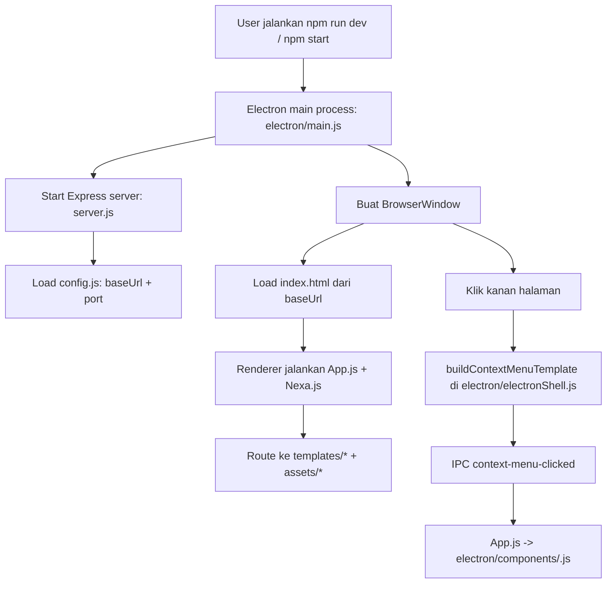

# Nexa Eletron

Aplikasi desktop **Electron** yang menjalankan **Express** sebagai server lokal dan memuat antarmuka **Nexa** (SPA) di jendela Chromium. Cocok untuk pengembangan dan distribusi satu paket: backend ringan + frontend modul `assets/modules` + halaman di `templates/`.

## Daftar Isi

- [Alur diagram kerja](#alur-diagram-kerja)
- [Struktur proyek](#struktur-proyek)
- [Arsitektur singkat](#arsitektur-singkat)
- [Prasyarat](#prasyarat)
- [Instalasi](#instalasi)
- [Menjalankan](#menjalankan)
  - [Hot reload (`npm run dev`)](#hot-reload-npm-run-dev)
- [Konfigurasi](#konfigurasi)
  - [`config.js`](#configjs)
  - [Ikon & build Windows](#ikon--build-windows)
  - [Variabel lingkungan (opsional)](#variabel-lingkungan-opsional)
- [File penting](#file-penting)
- [`electron/electronShell.js` — layout jendela dan menu konteks](#electronelectronshelljs--layout-jendela-dan-menu-konteks)
  - [Integrasi dengan `main.js`](#integrasi-dengan-mainjs)
  - [`mainWindowLayout`](#mainwindowlayout)
  - [`buildContextMenuTemplate(ctx)`](#buildcontextmenutemplatectx)
- [Menu konteks & `electron/components`](#menu-konteks--electroncomponents)
- [Build & keamanan](#build--keamanan)
- [Lisensi](#lisensi)

## Alur diagram kerja



## Struktur proyek

```text
eletronDev/
├─ electron/
│  ├─ main.js
│  ├─ preload.js
│  ├─ csp.js
│  ├─ electronShell.js
│  └─ components/
├─ assets/
│  └─ modules/
├─ templates/
├─ index.html
├─ App.js
├─ server.js
├─ config.js
├─ electron.js
└─ package.json
```

## Arsitektur singkat

| Lapisan | Peran |
|--------|--------|
| **`electron/`** | Modul desktop: **`main.js`** (proses utama), **`preload.js`** (IPC ke renderer), **`csp.js`** (CSP untuk injeksi `server.js`). **`package.json` → `main`** menunjuk ke **`electron.js`** di akar proyek; berkas itu memuat **`electron/main.js`** dari **`electron/`** (dev) atau **`resources/electron/`** (build). |
| **server.js** | Server Express (ESM): static file, injeksi CSP + `window.__NEXA_ENDPOINT__` di awal `<head>`, API contoh, fallback SPA. |
| **`electron/electronShell.js`** | Shell desktop: opsi jendela utama + template menu klik kanan native (satu folder dengan `main.js`). |
| **App.js** | Entry SPA NexaRoute: routing, worker, service worker (opsional). |
| **templates/** | Halaman per rute Nexa. |
| **`electron/components/`** | Handler renderer untuk item menu konteks (ESM); disajikan sebagai **`/nexa-context/*`** lewat **`server.js`**. |

Alur dev: `npm run dev` → Electron menjalankan `server.js` → memuat URL dari `config.js` → renderer mengeksekusi `App.js` dari `index.html`.

## Prasyarat

- **Node.js** (versi yang didukung oleh dependensi proyek; LTS disarankan)
- **npm**

## Instalasi

```bash
npm install
```

## Menjalankan

| Perintah | Keterangan |
|----------|------------|
| `npm run dev` | Electron + **electronmon**: jalankan **sekali**, biarkan proses tetap jalan. Perubahan file disimpan → pemantau memicu reload otomatis (lihat **Hot reload** di bawah). |
| `npm start` | Electron **tanpa** pemantau file — setelah edit, refresh jendela sendiri (F5 / menu konteks **Refresh**). |
| `npm run server` | Hanya server Express (`node server.js`), berguna untuk uji di browser. |
| `npm run stop` | Membebaskan port default script (`kill-port` — sesuaikan port jika berbeda). |
| `npm run build` | Paket installer Windows (NSIS) lewat **electron-builder** → keluaran di folder `dist/`. |
| `npm run pack` | Build tanpa installer (folder `dist` untuk inspeksi). |

### Hot reload (`npm run dev`)

1. **Satu terminal** — setelah `npm run dev`, jangan mengulang `npm start` kecuali Anda menutup app.
2. **Simpan file** (Ctrl+S) — **electronmon** mendeteksi perubahan di proyek (kecuali `node_modules`, `dist`).
3. **File proses utama** (`electron/main.js`, `electron/preload.js`) — aplikasi **restart** penuh.
4. **Halaman & aset** (`templates/`, `assets/`, `electron/components/`, `App.js`, `index.html`, dll.) — isi jendela **reload** (cache HTTP diabaikan).
5. **Logika server** (`server.js`) — proses Express ikut dimuat di proses utama; jika Anda mengubah route/middleware API, **tutup jendela app lalu jalankan lagi** `npm run dev` (atau sentuh `electron/main.js` agar restart penuh).

**Penting:** URL dan port aplikasi harus selaras dengan **`config.js`** (lihat di bawah). Jika port untuk Express sudah dipakai proses lain, server gagal start — hentikan proses tersebut atau ubah URL di konfigurasi.

## Konfigurasi

### `config.js`

- Dipakai oleh **`server.js`** untuk `listen` dan `baseUrl`.
- Ke browser **tidak** di-expose sebagai file `/config.js`; nilai disuntik ke **`window.__NEXA_ENDPOINT__`** saat memuat `index.html`.
- Sesuaikan **`url`** (mis. `http://localhost:3007`) agar sama dengan port yang didengarkan server dan dengan yang dibuka Electron.

### Ikon & build Windows

- **`package.json` → `build.win.icon`**: ikon installer dan sumber ikon jendela di dev (`electron/main.js` membaca path yang sama).
- **`appId`**: `com.eletron.nexa` — dipakai untuk pengelompokan taskbar di Windows (`setAppUserModelId`).

### Variabel lingkungan (opsional)

| Variabel | Arti |
|----------|------|
| `ELECTRON_DEV=1` | Membuka DevTools saat jendela siap. |
| `ELECTRON_SINGLE_INSTANCE=1` | Satu instance; instance kedua memfokuskan jendela. |
| `ELECTRON_DISABLE_GPU=0` | Jangan matikan akselerasi GPU (default: GPU dimatikan lewat switch). |
| `ELECTRON_DISABLE_HTTP_CACHE=0` | Izinkan cache HTTP Chromium (default: cache disk dimatikan untuk dev). |
| `NEXA_DEV_NO_CACHE=0` | Bersama `NODE_ENV=production`, header no-cache untuk `/templates/`, `/assets/`, `/nexa-context/`, `/App.js` bisa dinonaktifkan. |
| `NODE_ENV=production` | Mode produksi untuk server (perilaku cache, dll.). |

## File penting

| File | Fungsi |
|------|--------|
| `electron.js` | Entry Electron di akar proyek; memuat **`electron/main.js`** dari `electron/` (dev) atau **`resources/electron/`** (installer). Build memakai **`asar: true`** ( **`assets/modules`** dll. di dalam **`app.asar`** ). |
| `electron/main.js` | Proses utama: `BrowserWindow`, menu konteks, membersihkan cache session, `require` **`index.js`** (server). |
| `electron/csp.js` | Membangun string CSP; diimpor oleh **`server.js`**. |
| `server.js` | Express: middleware, static root, `/assets`, **`/nexa-context/`** → `electron/components/`, API `/api/*`, blokir **`/electron/`** (keamanan; bukan modul menu). |
| `electron/preload.js` | `contextBridge`: menu konteks (`electronAPI.onContextMenuClick`, dll.). |
| `electron/electronShell.js` | Shell aplikasi: `mainWindowLayout` + `buildContextMenuTemplate` (**CommonJS**; di dev dimuat ulang tiap klik kanan / layout jendela baru — lihat bagian di bawah). |
| `index.html` | Shell SPA; `<base href="/">`; memuat `Nexa.js` dan `App.js`. |
| `App.js` | `NXUI.Page` — rute, endpoint; import **`/nexa-context/index.js`**; listener IPC menu konteks memanggil **`components(role)`**. |

## `electron/electronShell.js` — layout jendela dan menu konteks

Berkas ini memisahkan **ukuran/opsi jendela utama** dan **struktur menu klik kanan** dari logika panjang di `main.js`. Formatnya **CommonJS** (`module.exports`); `electron/main.js` memuatnya dengan `require()` dari path yang sama folder (`electron/electronShell.js`).

### Integrasi dengan `main.js`

- **Mode terpaket:** shell dibaca sekali saat bootstrap; nilai layout disimpan di memori (`mainWindowLayoutResolved`), builder menu tetap dari modul yang sama.
- **Development:** sebelum `require`, cache modul untuk `electronShell.js` dihapus (`delete require.cache[...]`) agar edit berkas langsung terasa:
  - **`buildContextMenuTemplate`** — dipakai lagi pada **setiap** pembukaan menu konteks.
  - **`mainWindowLayout`** — dipakai saat **`createWindow`** (jendela baru); ubahan ukuran/minimal tidak mengubah jendela yang sudah terbuka kecuali Anda buka jendela lagi atau restart app.

### `mainWindowLayout`

Objek ini dinormalisasi di `main.js` (`normalizeMainWindowLayout`) lalu sebagian besar kunci disalurkan ke `new BrowserWindow({ ... })` (properti `ContextMenu` disingkirkan dulu — hanya untuk switch menu).

Nilai default saat ini di `electron/electronShell.js` adalah `resizable: true`, `maximizable: true`, dan `ContextMenu: true`, sehingga pengguna bisa:

- mengubah ukuran jendela dengan drag tepi/corner,
- memaksimalkan jendela dari kontrol title bar,
- membuka menu klik kanan kustom di area halaman.

| Properti | Keterangan |
|----------|------------|
| `width`, `height` | Ukuran awal jendela. |
| `minWidth`, `minHeight` | Batas minimum resize. |
| `maxWidth`, `maxHeight`, `x`, `y`, `center`, `title` | Opsional; ikut diteruskan jika diset di objek. |
| `resizable`, `minimizable`, `maximizable`, `closable`, `fullscreenable`, `alwaysOnTop` | Perilaku jendela (boolean/opsi Electron). |
| **`ContextMenu`** | `true` (default): pasang menu konteks kustom dari template di bawah. `false`: peristiwa `context-menu` dicegah — tidak ada menu Chromium bawaan dan tidak ada menu kustom. |

Jika suatu kunci tidak ada di `electronShell.js`, `main.js` mengisi dari default internal (selaras dengan nilai default di berkas shell).

### `buildContextMenuTemplate(ctx)`

Fungsi yang mengembalikan array **template menu** untuk `Menu.buildFromTemplate` (API Electron). Parameter `ctx` disiapkan oleh `main.js`:

| Properti di `ctx` | Peran |
|-------------------|--------|
| `getMainWindow` | Mengembalikan `BrowserWindow` utama (untuk zoom, URL, dll.). |
| `isDev` | `true` jika app tidak terpaket atau `NODE_ENV=development` atau `ELECTRON_DEV=1` — menambahkan item **Developer Tools** dan **Inspect Element** (Inspect memakai `contextMenuParams.x` / `y`). |
| `clearCacheAndNotify` | Dipanggil oleh item **Bersihkan Cache** (HTTP cache + storage; bisa mengirim `cache-cleared` ke renderer). |
| `showAboutDialog` | Dialog **Tentang** (nama/versi dari `package.json`). |
| `contextMenuParams` | Objek parameter event konteks dari Electron (untuk `inspectElement`). |

**Struktur menu bawaan** (ringkas): **Refresh** → (dev: DevTools, Inspect) → pemisah → **Bersihkan Cache** → **Layar Penuh** → pemisah → **halaman** (mengirim `webContents.send('context-menu-clicked', { role: 'nexaTerminal', url, ... })`) → submenu **Setting** (zoom normal / perbesar / perkecil) → submenu **Jendela** (minimize, tutup) → submenu **Bantuan** → **Tentang**.

Untuk perilaku di sisi SPA, salinlah pola item **halaman**: kirim channel **`context-menu-clicked`** dengan objek yang memuat **`role`**; renderer menanganinya lewat preload (`electronAPI.onContextMenuClick`) dan **`electron/components/<role>.js`** (sajian lewat `/nexa-context/`). Detail alur ada di bagian berikutnya.

## Menu konteks & `electron/components`

- Item menu yang mengirim **`context-menu-clicked`** (dari template di **`electron/electronShell.js`**) diterima di **`App.js`** lewat **`window.electronAPI.onContextMenuClick`**.
- **`electron/components/index.js`** memuat dinamis **`./<role>.js`** (mis. `nexaTerminal` → `nexaTerminal.js`); modul di-fetch dari URL **`/nexa-context/`** (bukan path **`/electron/`** mentah).
- Menambah handler: berkas baru di **`electron/components/<role>.js`** mengekspor fungsi bernama sama dengan **`role`**, lalu kirim **`role`** itu dari template menu di **`electron/electronShell.js`**.

## Build & keamanan

- **electron-builder** mengemas **`resources/app.asar`** ( **`assets/modules`**, **`templates`**, **`index.js`**, dll.). Folder proses utama **`electron/`** tetap di **`extraResources`**. Ikona & metadata di **`package.json` → `build`**.
- Pola **`build.files`** mengecualikan banyak file dari paket; pastikan aset yang diperlukan tidak terkecualikan secara tidak sengaja.
- Server menolak melayani nama file sensitif di root URL (mis. `server.js`, `config.js`, `package.json`, `.env`).

## Lisensi

MIT (lihat `package.json`).
