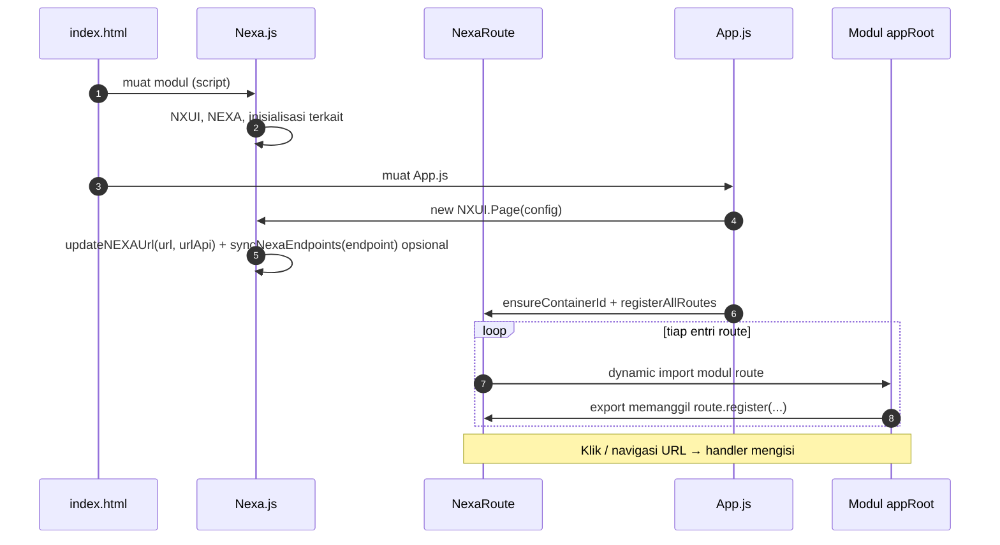
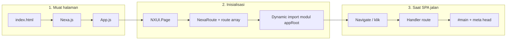

# Panduan NexaJS — inisiasi & menjalankan aplikasi

Dokumen ini menjelaskan alur **entry HTML**, **inisiasi `NXUI.Page`** di `App.js`, dan **cara menjalankan** proyek SPA NexaJS di folder ini.

## Daftar isi

- [Ringkasan alur](#ringkasan-alur)
  - [Alur kerja NexaJS (diagram)](#alur-kerja-nexajs-diagram)
- [1. Entry: `index.html](#1-entry-indexhtml)`
  - [Base href](#base-href)
  - [Memuat NexaJS](#memuat-nexajs)
  - [NXUI, NX, dan `nx` — API global (Nexa.js)](#global-nx-dan-handler-string-nexajs)
    - [NXUI](#nxui)
    - [NX](#nx-alias-besar)
    - `[nx](#nx-shorthand)`
  - [Kontainer route](#kontainer-route)
  - [Navigasi](#navigasi)
- [2. Inisiasi: `App.js](#2-inisiasi-appjs)`
  - [Wajib disesuaikan dengan lingkungan Anda](#wajib-disesuaikan-dengan-lingkungan-anda)
  - [Endpoint multi-API (`endpoint`)](#endpoint-multi-api-endpoint)
  - [Route di `App.js` (`route`, meta, `onRoute`)](#route-di-appjs-route-meta-onroute)
  - [Spinner](#spinner)
  - [Debug route](#debug-route)
  - [Web Worker](#web-worker)
  - [Service Worker](#service-worker)
- [3. Cara menjalankan (development)](#3-cara-menjalankan-development)
  - [Opsi A: PHP built-in server + `router.php](#opsi-a-php-built-in-server--routerphp)`
  - [Opsi B: server statis / lain](#opsi-b-server-statis--lain)
- [4. Route, sub-route, modul `appRoot`, dan meta](#4-route-sub-route-modul-approot-dan-meta)
  - [Pemetaan `route` ke modul dan pola handler](#pemetaan-route-ke-modul-dan-pola-handler)
  - [Sub-route dinamis (satu handler, URL bertingkat)](#sub-route-dinamis-satu-handler-url-bertingkat)
  - `[route.Layer` — kartu & sortable (`NXUI.Layer`)](#route-layer--kartu--sortable-nxuilayer)
  - [Cuplikan fungsi kartu untuk `content](#cuplikan-fungsi-kartu-untuk-content)`
  - [NexaGrid (NXUI.grid) — layout & parameter style](#nexagrid-nxuigrid--layout-dan-parameter-style)
  - `[NXUI.load` — navigasi programatik ke route](#nxui-load--navigasi-programatik-ke-route)
  - `[NXUI.Refresh` — refresh route & partial (`nexaRoute.refresh`)](#nxui-refresh--refresh-route--partial-nexarouterefresh)
  - `[NXUI.map` / `render` / `mapJoin` — HTML dari array](#nxui-render--html-dari-array)
  - `[routeMetaByRoute`, `onRoute`, dan `NXUI.setPageMeta](#routemetabyroute-onroute-dan-nxuisetpagemeta)`
- [5. Checklist cepat](#5-checklist-cepat)
- [6. File terkait (referensi)](#6-file-terkait-referensi)

---


## Ringkasan alur

1. `**index.html`** memuat pustaka `**/assets/modules/Nexa.js**` (modul), lalu `**/App.js**` (modul).
2. `**App.js**` membuat satu instance `**new NXUI.Page({ ... })**` — ini menginisialisasi routing SPA, base URL backend/API (termasuk `**endpoint**` multi-API bila diisi), container konten, spinner, Web Worker, dan Service Worker (jika diaktifkan).

Setelah `**Nexa.js**` termuat, tersedia `**NXUI**` (API utama), `**NX**` (alias pendek, identik dengan `**NXUI**`), dan `**nx**` (shorthand terpisah untuk callback berbasis string) — lihat [NXUI, NX, dan `nx](#global-nx-dan-handler-string-nexajs)`.

Urutan script di HTML **harus** NexaUI dulu, baru `App.js`, agar simbol global seperti `NXUI` tersedia saat `App.js` dieksekusi.


### Alur kerja NexaJS (diagram)

Diagram urutan di bawah merangkum **bootstrap** SPA: muat pustaka → `NXUI.Page` → pendaftaran route → impor modul di `**appRoot`** → handler mengisi kontainer. (Versi sumber ringkas ada di `docs/md.as`.)




**Alur ringkas (tanpa diagram):** browser memuat **NexaUI** → **App.js** membuat `**NXUI.Page`** → **NexaRoute** mendaftarkan handler dari **dynamic import** modul per route → interaksi user memicu **navigate** → konten di-render di `**containerId`**, **Service Worker** / **Web Worker** berjalan paralel sesuai konfigurasi.




---


## 1. Entry: `index.html`


### `<base href="/">`

Menetapkan root URL dokumen. Link seperti `/beranda`, `/contact/data` di-resolve ke origin yang sama (bukan relatif ke subfolder). Jika aplikasi di-deploy di subpath (misalnya `https://domain.com/app/`), sesuaikan `href` ke subpath tersebut.


### Memuat NexaJS

```html
<script type="module" src="/assets/modules/Nexa.js"></script>
```

Path absolut dari root situs; pastikan server development mengarahkan ke folder proyek sehingga `/assets/...` dan `/App.js` bisa diakses.


### NXUI, NX, dan `nx` — API global (Nexa.js)

Setelah `**Nexa.js**` selesai dieksekusi, tiga nama global berikut berkaitan dengan API Nexa. Implementasinya ada di `**assets/modules/Nexa.js**` (sekitar baris 1097–1174).


#### NXUI

- `**NXUI**` adalah **objek API utama** Nexa: method utilitas, `**Page`**, selektor (`element`, `$`), manajemen data global (`setGlobal`, `getGlobal`, …), dan lainnya (lihat `nxuiBase` di file yang sama).
- Setelah diisi, `**NXUI**` dibungkus `**Proxy**`:
  - `**set**` — nilai yang **bukan** `function`, bukan nama yang diawali `_`, dan bukan `constructor` / `prototype`, juga ditulis ke `**window[namaProperti]`** (sinkron data ke global untuk kompatibilitas kode lama).
  - `**get**` — baca dulu dari `**NXUI**`; jika tidak ada, **fallback** ke `**window`** (asal nilainya bukan `undefined`).
- Inisiasi aplikasi memakai nama ini secara eksplisit, misalnya `**new NXUI.Page({ ... })**` di `**App.js**`.


#### NX

- `**NX**` adalah **alias pendek** untuk `**NXUI`**: `**window.NX = window.NXUI**` (satu referensi yang sama).
- `**NX === NXUI**` bernilai `**true**`; perilaku `**set` / `get**` identik dengan `**NXUI**` (bukan perilaku khusus `**nx**`).
- Cocok jika Anda ingin nama lebih ringkas di kode tanpa mengubah semantik API utama.


#### `nx` (huruf kecil)

- `**nx**` adalah **shorthand terpisah**, bukan referensi yang sama dengan `**NXUI`**:
  1. **Inisialisasi** — objek `**{ ...window.NXUI, _global, _ui }`**: salinan satu kali properti yang terlihat dari `**NXUI**` saat itu, ditambah `**_global**` (instance global Nexa) dan `**_ui**` (instance kit/DOM).
  2. **Proxy kedua** — saat Anda menetapkan `**nx.namaFungsi = function () { … }`**, handler `**set**` juga menyalin fungsi ke `**window[namaFungsi]**`. Ini mendukung callback berbasis **nama string** (modal, form, atribut HTML).
  3. `**get`** pada Proxy `**nx**` — baca dari objek `**nx**` dulu; fallback ke `**window` hanya jika** properti di `**window`** bertipe `**function**` (lebih sempit daripada fallback `**NXUI**`).
- **Resolusi di komponen** — misalnya `**NexaForm`** (`onclick.send`) mencari nama fungsi dengan urutan: `**window**` → `**NXUI**` → `**nx**` → `**nx._global**`.

**Praktik di template route:** mendaftarkan handler dengan `**nx.nexaFormDemoSubmit = async function …`** di `templates/form.js` selaras dengan pola modal/route lain; setara dengan `**globalThis.nexaFormDemoSubmit**` atau `**window.nexaFormDemoSubmit**` mengingat urutan di atas.

Cuplikan handler (route `/form`):

```javascript
nx.nexaFormDemoSubmit = async function (formId, formData, setDataBy) {
  console.log("[nexaFormDemoSubmit]", { formId, formData, setDataBy });
  const out = document.getElementById("nexaFormDemoOutput");
  if (out) {
    out.textContent = JSON.stringify({ formData, setDataBy }, null, 2);
  }
};
```

Detail form, validasi, dan `**onclick.send**`: lihat `**docs/form.md**` (§1.1 dan seterusnya).


### Kontainer route

```html
<div id="main"></div>
<script type="module" src="/App.js"></script>
```

ID `main` harus cocok dengan `**containerId**` di `App.js` (`'main'`).


### Navigasi

Anchor dengan `href` ke path SPA (mis. `/beranda`, `/blog`) dipakai NexaRoute untuk navigasi tanpa reload penuh — selaras dengan daftar `**route**` di `App.js`.

---


## 2. Inisiasi: `App.js`

Inisiasi utama adalah **satu** pemanggilan:

```js
const req = new NXUI.Page({ /* konfigurasi */ });
```


### Wajib disesuaikan dengan lingkungan Anda


| Opsi              | Fungsi                                                                                                                                                                                                       |
| ----------------- | ------------------------------------------------------------------------------------------------------------------------------------------------------------------------------------------------------------ |
| `**url**`         | Base URL **backend** (halaman/server yang melayani SPA/template). Diteruskan ke `NEXA.url`. Bisa di-set di root atau di dalam `**endpoint.url`** (lihat [Endpoint multi-API](#endpoint-multi-api-endpoint)). |
| `**urlApi**`      | Base URL **API data** (endpoint terpisah jika ada). Menjadi sumber `**NEXA.apiBase`** (bersama fallback `url + /api`). Bisa di root atau di `**endpoint.urlApi**`.                                           |
| `**containerId**` | ID elemen DOM tempat konten route di-render (sesuai `#main` di HTML).                                                                                                                                        |
| `**mountPath**`   | Jika SPA tidak di root URL, isi prefix path (mis. `"app"` untuk `/app/...`). Kosong `''` jika SPA di root.                                                                                                   |
| `**appRoot**`     | Folder template relatif ke konvensi proyek (mis. `'templates'`).                                                                                                                                             |


Sesuaikan `**url**` / `**urlApi**` (atau `**endpoint**`) dengan port/host server yang benar-benar Anda jalankan; nilai di repositori hanya contoh lokal.


### Endpoint multi-API (`endpoint`)

Anda bisa mengelompokkan base URL dan API tambahan dalam satu objek `**endpoint**`. Nilai ini mengisi `**NEXA.url**`, `**NEXA.apiBase**`, `**NEXA.drive**` (lewat `updateNEXAUrl`), dan `**NEXA.endpoint**` (snapshot lengkap), serta menyalin **string URL** tambahan ke properti `**NEXA`** dengan nama yang sama (mis. `typicode` → `NEXA.typicode`) lewat `**NXUI.syncNexaEndpoints**`.

Properti yang **tidak** di-*mirror* ke root `NEXA` (tetap hanya di `NEXA.endpoint` / dipakai framework): `url`, `urlApi`, `apiBase`, `drive`, `userId`, `controllers`, `worker`, `serviceWorker`, `endpoint` — agar tidak bentrok dengan state internal.

**Prioritas:** jika `**endpoint.url`** ada, ia mengalahkan `**url**` di root config. `**endpoint.urlApi**` mengalahkan `**urlApi**` di root jika tidak kosong.

Contoh:

```js
endpoint: {
  url: "http://localhost:8001",
  urlApi: "http://localhost:3000",
  typicode: "https://jsonplaceholder.typicode.com/posts",
},
```

Setelah init: `**NEXA.endpoint.typicode**` dan `**NEXA.typicode**` berisi URL yang sama (normalisasi slash/https sesuai `Nexa.js`).

**Kompatibilitas:** konfigurasi lama `**url`** + `**urlApi**` di root (tanpa `endpoint`) tetap didukung.


### Route di `App.js` (`route`, meta, `onRoute`)

- `**route**`: array string path yang didaftarkan ke NexaRoute dan bisa dinavigasi tanpa reload penuh — selaras dengan tautan di `index.html` dan modul di bawah `appRoot` (§4).
- `**defaultRouteMeta**`: metadata default (judul, deskripsi) untuk halaman.
- `**onRoute**`: callback tiap pergantian route; di proyek ini memakai `**NXUI.setPageMeta**` (title, OG, canonical, dll.). Detail `**routeMetaByRoute**` ada di [§4](#routemetabyroute-onroute-dan-nxuisetpagemeta).

Cuplikan `**route**` dari proyek ini:

```js
route: [
    'beranda',
    'about',
    'blog',
    'contact',
    'guides',
    'contact/data',
],
```

- `**contact/data**`: satu entri ber-path (bukan dua entri terpisah) agar cocok dengan URL `/contact/data` dan impor modul sesuai aturan `contentIndex` (§4).
- **Urutan** array: dipakai antara lain saat kunjungan pertama (fallback ke route pertama jika belum ada riwayat route).
- **Sub URL** di bawah satu base (mis. `/blog/...`) tidak selalu membutuhkan entri tambahan: cukup satu entri base jika handler memakai `**nav.subRoute`** ([§4](#sub-route-dinamis-satu-handler-url-bertingkat)).

Detail pemetaan `**route` → modul**, **sub-route**, dan meta: [§4](#4-route-sub-route-modul-approot-dan-meta).


### Spinner

Objek `**spinner`** mengatur loading UI (overlay/inline, ukuran, warna, pesan). Nonaktifkan dengan `enabled: false` jika tidak diperlukan.


### Debug route

- `**debugRouteErrors**`: `true` menampilkan stack error di halaman saat route gagal; untuk produksi set `**false**`. Alternatif: query `**?nexaDebug=1**` tanpa mengubah file (sesuai komentar di kode).


### Web Worker

```js
webWorker: {
  enabled: true,
  storage: true,
  /** true = cache respons Storage (api/get/url/post/package/models) di IndexedDB: tampilkan data cache dulu, lalu perbarui di background; fetch tetap lewat worker jika storage aktif */
  indexedDB: true,
  /** Umur cache (ms). Default 24 jam. Set 0 untuk menonaktifkan TTL (perilaku lama: tidak pernah kedaluwarsa menurut waktu). */
  storageCacheTtlMs: 86400000,
  /** true = log [NexaWorker] di konsol — tidak mengubah tampilan; worker hanya memindahkan fetch/parse ke thread lain */
  debug: false,
},
```


| Opsi                    | Fungsi                                                                                                                                                                                                                                                                                                                                                                                                                                                                                                                                             |
| ----------------------- | -------------------------------------------------------------------------------------------------------------------------------------------------------------------------------------------------------------------------------------------------------------------------------------------------------------------------------------------------------------------------------------------------------------------------------------------------------------------------------------------------------------------------------------------------- |
| `**enabled**`           | Mengaktifkan dedicated Web Worker untuk fetch/parse terpisah dari thread UI (mis. `Storage().package`).                                                                                                                                                                                                                                                                                                                                                                                                                                            |
| `**storage**`           | Jika `false`, Storage tidak memakai worker (fallback ke fetch di thread utama).                                                                                                                                                                                                                                                                                                                                                                                                                                                                    |
| `**indexedDB**`         | Jika `true` (dan `enabled` + `storage` tidak `false`), respons JSON Storage yang memakai cache key disimpan di **IndexedDB** (`NexaStorageAPICache`). **Cache segar:** data lokal dipakai terlebih dahulu, lalu **pembaruan di background** (stale-while-revalidate). Jika JSON berubah, halaman bisa mendengarkan event `**nexa-storage-cache-update`** (`detail.cacheKey`, `detail.data`). **Cache kedaluwarsa** (lewat `storageCacheTtlMs` atau entri tanpa timestamp): diperlakukan seperti miss — **fetch jaringan dulu**, lalu simpan ulang. |
| `**storageCacheTtlMs`** | Waktu hidup cache dalam **milidetik**. Default **86400000** (24 jam). `**0`** mematikan pengecekan waktu: entri yang sudah punya `cachedAt` tetap dianggap valid selama ada di DB (perilaku tanpa TTL). Entri lama tanpa `cachedAt` tetap dianggap kedaluwarsa sampai satu kali fetch mengisi ulang.                                                                                                                                                                                                                                               |
| `**debug**`             | `true` menambah log `[NexaWorker]` di konsol.                                                                                                                                                                                                                                                                                                                                                                                                                                                                                                      |


Implementasi cache di `**assets/modules/Buckets/NexaStorage.js**`.


### Service Worker

```js
serviceWorker: {
  enabled: true,
  scriptUrl: "/sw.js",
  scope: "/",
  backgroundSync: true,
  debug: true,
}
```

- `**scriptUrl**`: harus dari **root** situs (bukan hanya di `/assets/...`) agar **scope `/`** diizinkan browser.
- `**enabled: true**` diperlukan agar registrasi SW benar-benar jalan; objek kosong saja tidak mengaktifkan perilaku.
- `**enabled: false**`: tidak mendaftarkan SW baru dan **meng-unregister** registrasi yang cocok `**scriptUrl`** (default `/sw.js`), agar halaman tidak lagi dikontrol SW lama. Setelah unregister, tab **mungkin perlu reload sekali** agar `navigator.serviceWorker.controller` benar-benar kosong.
- `**backgroundSync`**: menyiapkan event sync; halaman bisa memanggil `NXUI.registerNexaBackgroundSync('nexa-background-sync')` jika didukung browser.

Detail perilaku cache/offline ada di komentar header `**sw.js**`.

---


## 3. Cara menjalankan (development)


### Opsi A: PHP built-in server + `router.php`

Proyek menyertakan `**router.php**` agar MIME type untuk `.js`, `.css`, gambar, dll. benar di PHP CLI server.

Dari folder root proyek (yang berisi `index.html` dan `router.php`):

```bash
php -S localhost:8000 router.php
```

Lalu buka `**http://localhost:8000/**`. Ganti port (`8000`) jika bentrok.

**Penting:** Di `App.js`, `**url`** / `**urlApi**` (atau `**endpoint**`) harus mengarah ke layanan yang memang Anda jalankan (backend di `8001`, API di `3000`, dll.). Frontend di `8000` dan backend di port lain adalah pola umum — pastikan **CORS** di server API/backend mengizinkan origin frontend jika domain/port berbeda.


### Opsi B: server statis / lain

Setiap server yang menyajikan `index.html` di root dan file di `/assets/...`, `/App.js`, `/sw.js` dengan path yang sama bisa dipakai. Tetap perhatikan **HTTPS/localhost** untuk Service Worker (biasanya `localhost` diizinkan untuk SW).

---


## 4. Route, sub-route, modul `appRoot`, dan meta

Melanjutkan [Route di `App.js](#route-di-appjs-route-meta-onroute)`: pemetaan ke **modul**, **sub-route**, dan **metadata** (cuplikan `onRoute` di `App.js` baris 48–63).


### Pemetaan `route` ke modul dan pola handler

Untuk entri **string** di `route`, `NexaPage.registerAllRoutes()` memuat modul lewat `contentIndex` (`NexaRoute.js`). Untuk objek `route` dengan `**template`**, gunakan `registerTemplate` (lihat `NexaPage.registerAllRoutes()` di kode).


| Dari `route`     | Modul (relatif ke `appRoot`)                                                    | Nama export (fungsi) |
| ---------------- | ------------------------------------------------------------------------------- | -------------------- |
| `'beranda'`      | `beranda.js`                                                                    | `beranda`            |
| `'contact'`      | `contact.js`                                                                    | `contact`            |
| `'contact/data'` | `contact/data.js` **(disarankan)** **atau** `contact_data.js` di akar `appRoot` | `contact_data`       |


- **Subfolder di bawah `appRoot` didukung:** untuk `route` yang mengandung `/`, NexaJS memetakan ke path modul dengan **struktur folder yang sama** — mis. `'contact/data'` → `**{appRoot}/contact/data.js`** (folder `contact`, berkas `data.js`). Ini sesuai proyek ini: satu entri di `App.js` (`'contact/data'`) dan modul di `contact/data.js`.
- **Fallback (tanpa subfolder):** jika impor di atas gagal, dicoba `**{appRoot}/contact_data.js`** (satu berkas di akar `appRoot`, slash pada string route diganti `_` pada nama berkas).
- **Nama export** tidak mengikuti path folder: selalu `**route.replace(/\//g, "_")`** → fungsi bernama `**contact_data**` (identifier JS tidak boleh mengandung `/`).

**Membedakan dua hal:** (1) **Route ber-path** seperti `'contact/data'` — **wajib** ada di array `route` di `App.js` (mis. baris yang memuat `'contact/data'`), dan modul mengikuti tabel di atas. (2) **Sub-route dinamis** (mis. hanya `'blog'` di `route`, lalu URL `/blog/slug-tanpa-entri-baru`) — di [subsection berikut](#sub-route-dinamis-satu-handler-url-bertingkat); itu **bukan** pemetaan folder `blog/slug.js`, melainkan satu handler + `nav.subRoute`.

- Handler: `**export async function …(page, route)`** → `**route.register(page, callback)**` → isi `**container**`; `**route.routeMetaByRoute.set(page, routeMeta)**` bila memakai `**onRoute**` + `**NXUI.setPageMeta**` (uraian `[routeMetaByRoute` / `onRoute](#routemetabyroute-onroute-dan-nxuisetpagemeta)`).

Kerangka minimal:

```javascript
export async function namaRoute(page, route) {
  route.register(page, async (routeName, container, routeMeta = {
    title: "Judul | App",
    description: "Deskripsi halaman.",
  }, style, nav = {}) => {
    route.routeMetaByRoute.set(page, routeMeta);
    container.innerHTML = `<p>Route: ${routeName}</p>`;
  });
}
```


### `route.Layer` — kartu & sortable (`NXUI.Layer`)

`**route.Layer(options)**` adalah helper di `**NexaRoute**` (`assets/modules/Route/NexaRoute.js`) yang mempersingkat pola halaman berisi **kartu** dengan **drag/sort** lewat `**NXUI.Layer`** (alias kelas `**NexaLayer**`).

Tanpa helper ini Anda menulis manual: `innerHTML` untuk `.nx-row`, `new NXUI.Layer({...})`, `Container`, `NXUI.id(rowId).innerHTML`, lalu `drop()`. `**route.Layer**` menggabungkan langkah itu dan menghitung `**height**` untuk isi kartu lewat `**NXUI.Dimensi**` bila diperlukan.

**Prasyarat:** `NXUI.Layer` tersedia (biasanya lewat `Nexa.js`). Instance `**route`** di sini adalah **objek `NexaRoute`** yang diteruskan ke fungsi modul, mis. `export async function colom(page, route) { ... }` — **bukan** argumen `routeName` (string) di dalam callback `register`.

#### Opsi utama


| Opsi                                         | Fungsi                                                                                                                                                                                                                         |
| -------------------------------------------- | ------------------------------------------------------------------------------------------------------------------------------------------------------------------------------------------------------------------------------ |
| `**container`**                              | Elemen DOM yang diisi konten route (argumen handler `register`, wajib).                                                                                                                                                        |
| `**nav**`                                    | Objek `**{ baseRoute, subRoute }**` dari handler — dipakai untuk id baris default.                                                                                                                                             |
| `**page**`                                   | Kunci route yang sama dengan `**page**` di `export async function …(page, route)` — fallback untuk id baris jika perlu.                                                                                                        |
| `**content**`                                | Array konfigurasi kartu untuk `**NexaLayer.Container**`, atau fungsi async `**(ctx) => array**` dengan `**ctx**`: `{ rowId, rowSelector, height, nav, baseRoute }`.                                                            |
| `**dimensi**`                                | Cara menghitung `**height**` untuk kartu (scroll area), lewat `**NXUI.Dimensi().height**`. Lihat bentuk di bawah.                                                                                                              |
| `**height**`                                 | Jika diisi, dipakai langsung (tanpa Dimensi).                                                                                                                                                                                  |
| `**delay**`                                  | Milidetik sebelum init Layer (default **100**).                                                                                                                                                                                |
| `**rowId`**, `**idPrefix**`, `**baseRoute**` | Mengatur id elemen `.nx-row` (default id: `page_` + base route yang disanitasi).                                                                                                                                               |
| `**layer**`                                  | Objek tambahan di-*spread* ke `**new NXUI.Layer({ ... })*`*. Default global: `**showHeader` / `showFooter**` (boleh di-set di sini). **Tampilan** header/footer per kartu diatur di **item `content`** (lihat tabel di bawah). |


#### `dimensi` dan `containerId`

Default selector untuk Dimensi (jika tidak memakai bentuk panjang) mengikuti `**#` + `containerId**` pada instance `**NexaRoute**`, yang diset dari `**NXUI.Page**` di `**App.js**` (`**containerId: 'main'**` → selector `**#main**`). Jadi tidak perlu mengulang `**#main**` di setiap modul.

- **Singkat (disarankan jika mount = `#main`):** `dimensi: [390, "vh"]`  
Setara `**height("#main", 390, "vh")`** saat `**containerId**` adalah `**main**`.
- **Panjang (selector eksplisit):** `dimensi: ["#main", 390, "vh"]` — berguna jika tinggi diukur dari elemen lain.
- **Tanpa `dimensi` dan tanpa `height`:** fallback internal `**height(heightSelector, 390, 'vh')`** dengan `**heightSelector**` default `**#${containerId}**`.

#### Contoh

```javascript
export async function colom(page, route) {
  route.register(page, async (routeName, container, routeMeta = {
    title: "Judul | App",
    description: "…",
  }, style, nav = {}) => {
    route.routeMetaByRoute.set(page, routeMeta);
    await route.Layer({
      container,
      nav,
      page,
      dimensi: [390, "vh"],
      content: async ({ height }) => [
        /* kartu 1, kartu 2 — gunakan height untuk scroll area */
      ],
    });
  });
}
```


#### Cuplikan fungsi kartu untuk `content`

`**content**` membutuhkan **array objek baris** (satu objek = satu kartu/kolom). Pola yang disarankan: **satu fungsi `async` per kartu** yang mengembalikan konfigurasi untuk `NexaLayer.Container`, lalu gabungkan di `**content`** dengan `**await**`.


| Properti baris | Keterangan singkat                                                                                                                                                                                                                                                                                                   |
| -------------- | -------------------------------------------------------------------------------------------------------------------------------------------------------------------------------------------------------------------------------------------------------------------------------------------------------------------- |
| `**id**`       | Disarankan — menentukan `**#nx_card_{id}**` dan `**#nx_body_{id}**` di DOM (lihat [§ Refresh / ID kartu](#nxui-refresh--refresh-route--partial-nexarouterefresh)).                                                                                                                                                   |
| `**header**`   | `**false**` → tidak ada `**.nx-card-header**`. **String** → teks judul di `**<h6 class="nx-card-title">`** (sama peran dengan `**footer**` berisi string). Jika `**header**` tidak diisi tetapi `**title**` ada, dipakai `**title**` (kompatibilitas). `**header: ""**` (kosong) → fallback ke `**title**` jika ada. |
| `**title**`    | Opsional — dipakai sebagai judul kartu hanya jika `**header**` bukan string non-kosong (kode lama / tanpa `**header**`).                                                                                                                                                                                             |
| `**col**`      | Kelas grid, mis. `**nx-col-6**`.                                                                                                                                                                                                                                                                                     |
| `**scroll**`   | Mis. `**{ type: "nx-scroll-hidden", height }**` — `**height**` dari `**{ height }**` di callback `content`.                                                                                                                                                                                                          |
| `**footer**`   | `**false**` → tidak ada `**.nx-card-footer**`. **String** non-kosong → isi footer (jika `**showFooter`** global tidak `false`). **Dihilangkan** atau kosong → tidak ada footer.                                                                                                                                      |
| `**html`**     | Isi area scroll kartu (fragmen HTML).                                                                                                                                                                                                                                                                                |


Cuplikan minimal (dua kolom, seperti `templates/colom.js`):

```javascript
export async function kartuKiri(data, height) {
  return {
    id: "Notifications",
    header: "Notifications",
    col: "nx-col-6",
    scroll: { type: "nx-scroll-hidden", height },
    footer: false,
    html: "<p>Kolom kiri…</p>",
  };
}

export async function kartuKanan(data, height) {
  return {
    id: "SettingFailed",
    header: "Setting Failed",
    col: "nx-col-6",
    scroll: { type: "nx-scroll-hidden", height },
    footer: false,
    html: "<p>Kolom kanan…</p>",
  };
}

// Di dalam route.register → route.Layer:
content: async ({ height }) => [
  await kartuKiri(null, height),
  await kartuKanan(null, height),
],
```

Referensi lengkap di proyek ini: `**templates/colom.js**` (fungsi `**Failed**`, `**content2**`, dan pemanggilan di `**route.Layer**`).

**Nilai balik:** `Promise<{ render, rowId, rowSelector }>` — `**render`** adalah instance `**NXUI.Layer**`; `**rowId**` / `**rowSelector**` berguna untuk skrip lanjutan atau debug.

Implementasi lengkap dan opsi lain ada di komentar JSDoc method `**Layer**` pada `**NexaRoute.js**`.


### NexaGrid (NXUI.grid) — layout dan parameter style

Selain mengisi `**container.innerHTML**` atau memakai `**route.Layer**`, Anda bisa membangun **layout grid 12 kolom** lewat **NexaGrid**: instance siap pakai `**NXUI.grid**` (serta alias `**NXUI.NexaGrid**` / `**NXUI.Grid**` di `**Nexa.js**`). CSS grid (`**assets/modules/Grid/grid.css**`) ikut dipakai saat modul grid diinisialisasi.

#### Integrasi route (disarankan)

`**NexaRoute**` menyimpan **objek konfigurasi grid** per route dan meneruskannya ke handler sebagai argumen ke-**empat** (`**style**`):

1. Pendaftaran: `**route.register(page, handler, styleObject, routeMeta?)**` — argumen ketiga (`**styleObject**`) berisi misalnya `**useContainer**`, `**container: { nx: true }**`, dan `**rows**` (array baris berisi `**columns**` dengan `**cols**`, `**content**`, `**responsive**`, dll.).
2. Di callback handler: `**async (routeName, container, routeMeta, style, nav) => { ... }**` — panggil **`await route.applyGridStyle(container, style)`** bila `**style**` ada dan memiliki `**rows**`.

`**applyGridStyle**` mengosongkan `**container**`, lalu memanggil **`NXUI.grid.createGrid({ parent: container, ... })**` (lihat `**NexaRoute.js**`).

Helper ringkas tanpa menyusun object `**style**` penuh:

```javascript
await route.createGridLayout(container, rowsArray, { useContainer: true, nx: true });
```

`**createGridLayout**` membungkus pemanggilan `**applyGridStyle**` dengan `**rows: rowsArray**`.

#### Cuplikan (selaras dengan `docs/NexaGrid.md`)

```javascript
export async function grid(page, route) {
  route.register(
    page,
    async (routeName, container, routeMeta, style, nav = {}) => {
      route.routeMetaByRoute.set(page, routeMeta);
      if (style?.rows?.length) {
        await route.applyGridStyle(container, style);
      }
    },
    {
      useContainer: true,
      container: { nx: true },
      rows: [
        { columns: [{ cols: 12, content: "<h1>Judul</h1>", textAlign: "center" }] },
        {
          columns: [
            { cols: 8, content: "<p>Konten</p>" },
            { cols: 4, content: "<aside>Sidebar</aside>" },
          ],
        },
      ],
    },
    { title: "Grid | App", description: "…" }
  );
}
```

Contoh jalan di proyek ini: **`templates/grid.js`** (route **`/grid`** — pastikan string **`'grid'`** ada di array **`route`** di **`App.js`**).

#### Dokumentasi & API

- **Panduan lengkap:** **`docs/NexaGrid.md`** — opsi `**createCol**` / `**createRowWithCols**`, breakpoints, padding & margin, `**NXUI.grid.getCurrentBreakpoint()**`, dll.
- **Implementasi:** **`assets/modules/Grid/NexaGrid.js`**
- **Cuplikan imperatif** (tanpa parameter `**style**` route): `**await NXUI.grid.createGrid({ parent: container, useContainer: true, container: { nx: true }, rows })**` — tetap **`await`** agar konsisten dengan pola async di route (internal `**createGrid**` dapat dipanggil setelah CSS siap sesuai versi NexaUI Anda).

**Bedakan dengan `route.Layer`:** Layer membangun **kartu** di dalam **`.nx-row`** untuk drag/sort; NexaGrid membangun **baris/kolom** (`**nx-container**` / `**nx-row**` / `**nx-col**`) untuk halaman berbasis grid. Keduanya bisa dipakai di route berbeda atau dikombinasikan secara manual jika layout Anda membutuhkannya.


### `NXUI.load` — navigasi programatik ke route

Untuk **membuka route dari kode** (tombol, timer, respons API) tanpa mengklik tautan di menu, gunakan `**NXUI.load(route, pushState?)`**. Ini mendelegasikan ke `**window.nexaRoute.navigate**` — perilaku sama dengan navigasi SPA lewat anchor `**/path**` ([§ Navigasi](#navigasi)).

**Prasyarat:** `**NXUI.Page`** sudah dijalankan di `**App.js**` sehingga `**window.nexaRoute**` ada. String `**route**` harus **terdaftar** di array `**route`** konfigurasi halaman (mis. `'blog'`, `'markdown'`, `'ds/data'`) atau cocok dengan **sub-route dinamis** ([subsection berikut](#sub-route-dinamis-satu-handler-url-bertingkat)).


| Argumen                  | Keterangan                                                                                                                                                            |
| ------------------------ | --------------------------------------------------------------------------------------------------------------------------------------------------------------------- |
| `**route`**              | Path route tanpa slash di depan, mis. `**'blog'**`, `**'contact/data'**`, `**'guides/pengenalan'**`. Slash di ujung dipangkas.                                        |
| `**pushStateOrOptions**` | Opsional. Default `**true**`: menambah entri **history** browser. `**false`**: setara *replace* (tidak menumpuk history). Bisa juga objek `**{ pushState: false }*`*. |


**Contoh:**

```javascript
await NXUI.load('blog');
await NXUI.load('markdown');
await NXUI.load('ds/data');

// Tanpa menambah entri history (mis. redirect setelah aksi)
await NXUI.load('beranda', false);
await NXUI.load('form', { pushState: false });
```

**Setara:** `**await window.nexaRoute.navigate('blog')`**. Jika `**nexaRoute**` belum siap, peringatan muncul di konsol.

Implementasi: `**assets/modules/Nexa.js**` (properti `**load**` pada `**NXUI**`).


### `NXUI.Refresh` — refresh route & partial (`nexaRoute.refresh`)

Setelah halaman berisi kartu lewat `**route.Layer**` / `**NXUI.Layer**`, Anda sering perlu **memuat ulang** konten tanpa klik menu: misalnya setelah simpan form atau sinkron data. Nexa menyediakan dua tingkat:


| Tingkat               | API                                                     | Kapan dipakai                                                                                                                      |
| --------------------- | ------------------------------------------------------- | ---------------------------------------------------------------------------------------------------------------------------------- |
| **Route penuh (SPA)** | `NXUI.Refresh.refresh()` → `window.nexaRoute.refresh()` | Menjalankan lagi **handler route** untuk route aktif (clear `#main` sesuai logika navigate, spinner, `nxui:routeChange`).          |
| **Sebagian DOM**      | `NXUI.Refresh.partial({ ... })`                         | Hanya mengganti **satu node** (mis. isi scroll satu kartu) — **tanpa** `navigate` / tanpa menjalankan ulang seluruh handler route. |


**Prasyarat route penuh:** instance `**window.nexaRoute`** sudah dibuat oleh `**NXUI.Page**` (jika belum siap, `refresh()` memperingatkan di konsol).

#### `NXUI.Refresh.refresh(options?)`

Mendelegasikan ke `**nexaRoute.refresh(options)**` (`assets/modules/Route/NexaRoute.js`). Berguna setelah data berubah dan Anda ingin **tampilan seluruh route** konsisten dengan handler terdaftar.


| Opsi            | Fungsi                                                                                    |
| --------------- | ----------------------------------------------------------------------------------------- |
| `**route`**     | String route yang akan dimuat ulang; default **route aktif** (`currentRoute`).            |
| `**pushState`** | `true` menambah entri history; default `**false**` (replace) agar tidak menumpuk history. |
| `**hard**`      | `true` memanggil `**window.location.reload()**` (reload penuh browser, bukan SPA).        |


**Catatan:** `navigate()` melewati route jika path sama dengan route aktif; `**refresh()`** mem-bypass guard itu dengan memuat ulang handler untuk path yang sama.

#### `nexaRoute.refresh()` (langsung)

Anda juga bisa memanggil `**await window.nexaRoute.refresh()**` — perilaku sama dengan `**NXUI.Refresh.refresh()**`.

#### `NXUI.Refresh.partial(options)`

Memperbarui **satu** elemen di dalam DOM (biasanya `**innerHTML`** atau `**update**`). Tidak memanggil `**nexaRoute.navigate**`.


| Opsi             | Fungsi                                                                                                                                                                                                                                                |
| ---------------- | ----------------------------------------------------------------------------------------------------------------------------------------------------------------------------------------------------------------------------------------------------- |
| `**target**`     | Wajib: **selector CSS** (disarankan `#id`) atau `**Element`**.                                                                                                                                                                                        |
| `**scope**`      | Akar pencarian target. `**undefined**` → default `**#main**` jika ada (kontainer route). `**null**` / `**false**` → cari di **seluruh `document`** (hati-hati jika ID duplikat di luar route). String (`"#main"`) atau `**Element**`.                 |
| `**html**`       | String → di-set ke `innerHTML` target.                                                                                                                                                                                                                |
| `**render**`     | `async () => string | Element` — isi baru; string dipasang sebagai `**innerHTML**`.                                                                                                                                                                   |
| `**update**`     | `async (el) => void` — kontrol penuh atas node target.                                                                                                                                                                                                |
| `**keepScroll**` | `**true**`: sebelum mengubah target, simpan `**scrollTop**` semua elemen `**[id^="nx_body_"]**` di dalam **scope** **kecuali** target; setelah update, pulihkan di `**requestAnimationFrame`** (mengurangi “lompat” scroll kolom **NexaLayer** lain). |
| `**event`**      | `**false**` mematikan event global `**nxui:partialRefresh**` (default: terkirim setelah sukses).                                                                                                                                                      |


**Event:** setelah sukses, window memunculkan `**CustomEvent`** bernama `**nxui:partialRefresh**` dengan `**detail**`: `{ target, element }` (selector string jika target berupa string).

#### ID kartu NexaLayer (konsistensi dengan partial)

`NexaLayer.Container` (`assets/modules/Dom/NexaLayer.js`) membangun:

- **Kolom luar:** `id="nx_card_{safeId}"` — `safeId` dari `**row.id`** (karakter tidak aman diganti `_`; jika kosong dipakai `nx_card`).
- **Area scroll / isi `row.html`:** `id="nx_body_{safeId}"` — **ini** target yang tepat untuk partial (bukan mengganti seluruh `#nx_card_*` kecuali memang ingin mengganti satu kolom penuh).

Atribut `**data-nx-card-id`** pada wrapper menyimpan `**safeId**` untuk seleksi/debug.

#### Contoh: partial setelah simpan (kartu kedua saja)

```javascript
await NXUI.Refresh.partial({
  scope: "#main",
  target: "#nx_body_SettingFailed",
  keepScroll: true,
  render: async () => {
    const block = await content2(null, undefined);
    return block.html;
  },
});
```

#### Contoh: route penuh (semua handler route dijalankan lagi)

```javascript
await NXUI.Refresh.refresh();
// atau route tertentu:
await NXUI.Refresh.refresh({ route: "contact/data", pushState: false });
```

Implementasi `**partial**` ada di `**assets/modules/Nexa.js**`; `**refresh**` pada instance route ada di `**assets/modules/Route/NexaRoute.js**`.


### `NXUI.map` / `NXUI.render` / `NXUI.mapJoin` — HTML dari array (map + join)

Membangun **satu string HTML** dari data berbentuk **array** (atau iterable) tanpa menulis `**(arr || []).map(...).join(...)`** berulang. Setara dengan `**Array.from(list).map(fn).join(joiner)**` dengan penanganan aman jika `**list**` bukan array (misalnya `**null**` / `**undefined**` → array kosong; nilai yang tidak bisa di-`**Array.from**` → string kosong, tanpa melempar error).

`**NXUI.map**` mengembalikan `**Promise<string>**`: pemetaan memakai `**Promise.all**` ( `**fn` boleh `async**` atau mengembalikan `Promise` per item). **Di fungsi `async`, gunakan `await NXUI.map(...)`** — di sinilah `**await` bermakna** (bukan sekadar gaya).

`**NXUI.render`** dan `**NXUI.mapJoin**` adalah **satu implementasi sinkron** (alias): `**await NXUI.render(...)` tidak menunggu apa pun** karena hasilnya **bukan** Promise. Untuk konsistensi dengan alur `**async`**, pilih `**await NXUI.map**`.

Nama `**mapJoin**` menekankan bahwa ini **bukan** callback opsi `**render`** di `**NXUI.Refresh.partial({ render: async () => ... })**` dan bukan “render” virtual DOM.


| Argumen      | Jenis                                                   | Keterangan                                                                   |
| ------------ | ------------------------------------------------------- | ---------------------------------------------------------------------------- |
| `**list**`   | `Iterable` / `ArrayLike` / `null` / `undefined`         | Sumber item; `**null**` / `**undefined**` diperlakukan sebagai array kosong. |
| `**fn**`     | `(item, index, array) => string` atau `Promise<string>` | Wajib — fragmen string per item ( `**NXUI.map**` mendukung `async`).         |
| `**joiner**` | `string` (opsional)                                     | Pemisah antar fragmen; default `**""**`.                                     |


**Contoh di fungsi `async`** (disarankan — `NXUI.map`):

```javascript
const html = await NXUI.map(local.response, (item) => `<p>${item.a1} > ${item.a2}</p>`);

const html2 = await NXUI.map(local.response, async (item) => {
  return `<p>${item.a1} > ${item.a2}</p>`;
});
```

**Sinkron** (`mapJoin` / `render`, tanpa Promise):

```javascript
const html = NXUI.mapJoin(local.response, (item) => `<p>${item.a1} > ${item.a2}</p>`);
// setara: NXUI.render(...)
```

**Dipakai bersama partial:** hasil `**await NXUI.map(...)`** (atau string dari `**mapJoin**`) bisa menjadi `**html**` di kartu `**NXUI.Layer**`, atau Anda set sendiri sebagai string hasil di dalam **callback** bernama `**render`** pada `**NXUI.Refresh.partial({ render: async () => ... })**` — itu **parameter** `render`, **bukan** `**NXUI.render`**.

Implementasi: `**assets/modules/Nexa.js**` (properti `**map**`, `**mapJoin**`, `**render**` pada objek `**NXUI**`). Ini **bukan** API “virtual DOM” seperti contoh lama di dokumentasi Svg; untuk pohon komponen bertipe objek, gunakan pola lain atau `**innerHTML`** manual.


### Sub-route dinamis (satu handler, URL bertingkat)

Cukup **satu** entri route dasar di array `**route`** (mis. `'blog'` atau `'guides'`); **tidak** perlu mendaftar setiap anak sebagai string terpisah bila satu handler menanganinya.

NexaRoute mencocokkan **route terpanjang** yang terdaftar, lalu menyisakan sisa path sebagai **sub-route**. Di callback `route.register`, argumen kelima `**nav`** berisi:

- `**nav.baseRoute**` — route dasar yang terdaftar.
- `**nav.subRoute**` — sisa path setelah base (slug / segmen), atau kosong di indeks base.
- `**routeName**` — path internal penuh untuk logika atau tampilan.

`routeMeta` (argumen ke-3) **bukan** tempat sub-route; bedakan indeks vs anak lewat `**nav`**.

Tautan di dalam konten memakai path relatif ke `<base href="/">` agar navigasi SPA tanpa reload penuh.


### `routeMetaByRoute`, `onRoute`, dan `NXUI.setPageMeta`

- `**NexaRoute.routeMetaByRoute**` adalah `Map` yang menyimpan **objek meta per kunci route** (mis. `title`, `description`, `ogImage`). Di dalam handler modul route, panggil `**route.routeMetaByRoute.set(page, { title, description, ... })`** agar meta spesifik halaman tersimpan untuk `onRoute`.
- `**defaultRouteMeta**` di `NXUI.Page` (di `App.js`) menjadi **fallback** jika route tidak mengisi meta.
- `**onRoute`** di `App.js` dipanggil setiap kali route berganti. Objek `**routeInfo**` berisi antara lain `**defaultRouteMeta**` (dari konfigurasi halaman) dan `**routeMeta**` (yang diambil dari `routeMetaByRoute` untuk route aktif). Cuplikan:

```js
onRoute: (routeInfo) => {
  const def = routeInfo.defaultRouteMeta || {};
  const pack = routeInfo.routeMeta
    ? { ...def, ...routeInfo.routeMeta }
    : { ...def };
  const base = typeof location !== "undefined" ? location.origin : "";
  NXUI.setPageMeta({
    appName: "App",
    ...pack,
    ogUrl: typeof location !== "undefined" ? location.href : undefined,
    canonical: typeof location !== "undefined" ? location.href : undefined,
    ogImage: pack.ogImage || (base ? `${base}/assets/images/favicon.ico` : undefined),
  });
},
```

`**NXUI.setPageMeta**` (lihat `assets/modules/Route/setPageMeta.js`) memperbarui `<title>`, meta deskripsi, Open Graph, Twitter Card, canonical, dll. di `<head>`. Crawler sosial tetap bisa melihat HTML awal dari server; untuk SEO penuh seringkali perlu SSR/prerender — sesuai komentar di `setPageMeta.js`.

Sub-route **dinamis** (data API, meta per item): set `**route.routeMetaByRoute`** di handler sesuai `**nav.subRoute**` / `routeName`, lalu `**onRoute**` menggabungkan ke `**setPageMeta**`.

---


## 5. Checklist cepat

- `Nexa.js` dan `App.js` termuat tanpa error di Network tab.
- `url` / `urlApi` atau `**endpoint**` sesuai server yang hidup.
- Elemen `#main` ada dan `containerId` cocok.
- Daftar `route` mencakup semua path yang dipakai menu.
- Untuk produksi: `debugRouteErrors: false`, kurangi log SW/worker jika perlu.
- Jika memakai `**webWorker.indexedDB**`: sesuaikan `**storageCacheTtlMs**` (atau `0` tanpa TTL waktu); pantau event `**nexa-storage-cache-update**` bila UI harus re-render setelah data segar.
- Setiap entri `route` punya modul di `**appRoot**` (atau fallback `nama_route.js`) dan meta konsisten dengan `onRoute`.
- Jika UI hanya perlu memperbarui **satu blok** (satu kartu / satu list): pertimbangkan `**NXUI.Refresh.partial`** + `**keepScroll**` alih-alih `**NXUI.Refresh.refresh()**` agar tidak me-reset seluruh route.

---


## 6. File terkait (referensi)


| File                                        | Peran                                                                                                                                                                                                                                                                                        |
| ------------------------------------------- | -------------------------------------------------------------------------------------------------------------------------------------------------------------------------------------------------------------------------------------------------------------------------------------------- |
| `index.html`                                | Entry, `<base>`, nav, `#main`, urutan script                                                                                                                                                                                                                                                 |
| `App.js`                                    | Konfigurasi `NXUI.Page` (`endpoint`, `route`, dll.)                                                                                                                                                                                                                                          |
| `assets/modules/Nexa.js`                    | Pustaka UI, `updateNEXAUrl`, `syncNexaEndpoints`, route, Storage, `**NXUI.load**` (navigasi programatik ke route), `**NXUI.Refresh**` (`refresh`, `**partial**`, opsi `**keepScroll**`); `**NXUI**` / `**NX**` / `**nx**` — lihat [NXUI, NX, dan `nx](#global-nx-dan-handler-string-nexajs)` |
| `assets/modules/Route/NexaRoute.js`         | `NexaPage`, `NexaRoute`, registrasi route, `**route.Layer**` (helper `NXUI.Layer`), `**nexaRoute.refresh()**`                                                                                                                                                                                |
| `assets/modules/Dom/NexaLayer.js`           | Kartu layer: ID `**nx_card_***` / `**nx_body_***` (target partial)                                                                                                                                                                                                                           |
| `docs/NexaGrid.md`                          | Grid 12 kolom: `**NXUI.grid**`, `**route.applyGridStyle**`, `**route.createGridLayout**`, parameter `**style**` di `**route.register**` — lihat [§ NexaGrid](#nexagrid-nxuigrid--layout-dan-parameter-style)                                                                                |
| `assets/modules/Grid/NexaGrid.js`           | Implementasi kelas NexaGrid (`createGrid`, `createCol`, …)                                                                                                                                                                                                                                   |
| `templates/grid.js`                         | Contoh route **`/grid`** (demo layout dari `**applyGridStyle**`)                                                                                                                                                                                                                            |
| `sw.js`                                     | Service Worker (cache, offline, fallback `index.html`)                                                                                                                                                                                                                                       |
| `assets/modules/Worker/NexaWorkerClient.js` | Klien Web Worker (dipakai lewat NexaUI)                                                                                                                                                                                                                                                      |
| `assets/modules/Buckets/NexaStorage.js`     | `NXUI.Storage`: worker fetch + cache IndexedDB, TTL (`storageCacheTtlMs`), event `nexa-storage-cache-update`                                                                                                                                                                                 |
| `router.php`                                | Router untuk `php -S ... router.php`                                                                                                                                                                                                                                                         |
| `appRoot` (mis. `templates`)                | Modul per route: `route.register`, `routeMetaByRoute`, konten UI                                                                                                                                                                                                                             |


**Storage / API:** panggilan HTTP berantai memakai `**NXUI.Storage().api(...)`** atau `**NXUI.Storage().package(...)**` — bukan `NXUI.api` (simbol tersebut tidak ada).

Dengan mengikuti urutan memuat script, menyelaraskan `**url` / `urlApi**` atau `**endpoint**`, mendaftarkan `**route**` di `**App.js**`, dan menyelaraskan modul di `**appRoot**` serta meta di `**onRoute**`, aplikasi NexaJS di proyek ini siap dijalankan dan dikembangkan lebih lanjut.