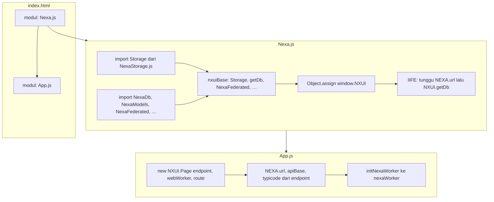
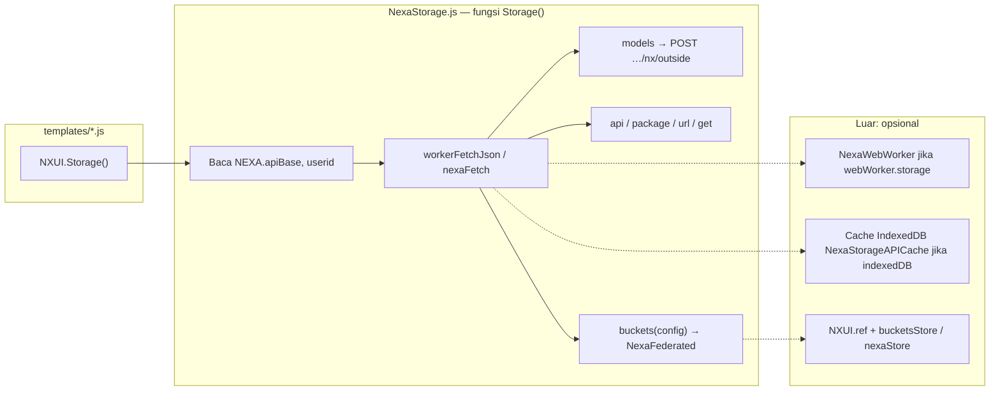

# Panduan `NXUI.Storage()` — pola dari `App.js` / route

Dokumen ini menjelaskan contoh pemakaian **`NXUI.Storage()`** di template route dan hubungannya dengan **`endpoint`** di **`App.js`**.

## Daftar isi

- [Diagram alur kerja `NXUI.Storage`](#diagram-alur-nxuistorage)
- [Hubungan dengan `endpoint` (`App.js`)](#hubungan-dengan-endpoint-appjs)
- [1. `Storage().api(row, body)` — POST ke API base](#1-storageapi-row-body--post-ke-api-base)
- [2. `Storage().get(NEXA.typicode)` — GET ke URL dari `endpoint`](#2-storagegetnexatypicode--get-ke-url-dari-endpoint)
- [3. `Storage().package().method()` — chain paket ke controller PHP](#3-storagepackagemethod--chain-paket-ke-controller-php)
- [4. `Storage().models("ClassPhp", { method, params })` — model PHP langsung](#4-storagemodelsclassphp-method-params--model-php-langsung)
- [5. `Storage().models("User").byAvatar(1)` — chaining ke model PHP](#5-storagemodelsuserbyavatar1--chaining-ke-model-php)
- [6. `Storage().model("news").select("*").get()` — query builder tabel SQL](#6-storagemodelnewsselectget--query-builder-tabel-sql)
- [7. `Storage().buckets(config)` — Federated (database / IndexedDB / Firebase)](#7-storagebucketsconfig--federated-database--indexeddb--firebase)
  - [Argumen `config`](#argumen-config)
  - [Objek yang dikembalikan](#objek-yang-dikembalikan)
  - [Mode penyimpanan](#mode-penyimpanan)
  - [Konfigurasi Firebase (`firebaseConfig`)](#konfigurasi-firebase-firebaseconfig)
  - [Contoh ringkas](#contoh-ringkas)
  - [Realtime Firebase (`getRealtime`)](#realtime-firebase-getrealtime)
  - [Metadata `nexaStore` vs fallback](#metadata-nexastore-vs-fallback)
- [Web Worker & cache respons (`App.js`)](#web-worker--cache-respons-appjs)
- [Ringkasan alur data](#ringkasan-alur-data)

---

<a id="diagram-alur-nxuistorage"></a>

## Diagram alur kerja `NXUI.Storage`

Berikut alur dari **`index.html`** sampai **`NXUI.Storage()`** siap dipakai di template route, berdasarkan **`proyek/index.html`**, **`proyek/App.js`**, dan **`proyek/assets/modules/Nexa.js`** (+ **`NexaStorage.js`**).

### Muat skrip & inisialisasi global



Urutan eksekusi praktis: **Nexa.js** dieksekusi dulu (mendefinisikan **`window.NXUI.Storage`**), lalu **App.js** membuat **`NXUI.Page`** sehingga **`NEXA.apiBase`** dan **`endpoint`** terisi — **baru** pemanggilan **`NXUI.Storage().api` / `.models` / `.buckets`** di route punya URL yang benar.

### Satu pemanggilan `NXUI.Storage()` di route



- **Worker + cache** hanya dipakai jika **`App.js`** mengaktifkan **`webWorker`** (lihat bagian [Web Worker & cache](#web-worker--cache-respons-appjs)).  
- **`buckets()`** menambah cabang ke **`NexaFederated`** (database / IndexedDB / Firebase), yang juga memakai **`NXUI.ref`** untuk metadata lokal.

### Berkas utama (referensi cepat)

| Berkas | Peran untuk Storage |
|--------|---------------------|
| **`index.html`** | Memuat **Nexa.js** lalu **App.js**; kontainer **`#main`** untuk isi route. |
| **`assets/modules/Nexa.js`** | Mengimpor **`Storage`** dari **`NexaStorage.js`**, menempelkannya ke **`window.NXUI.Storage`**; **`getDb`**, **`NexaFederated`**, inisialisasi **`NEXA`** + IIFE **`getDb()`**. |
| **`App.js`** | **`new NXUI.Page({ endpoint, webWorker, … })`** → mengisi **`NEXA.url` / `apiBase` / `typicode`**; **`initNexaWorker`**. |
| **`assets/modules/Buckets/NexaStorage.js`** | Implementasi **`Storage()`**: **`api`**, **`get`**, **`models`**, **`model`**, **`buckets`**, worker + cache. |
| **`assets/modules/Buckets/NexaFederated.js`** | Dipakai oleh **`buckets()`** untuk federasi database / IndexedDB / Firebase. |

---

<a id="hubungan-dengan-endpoint-appjs"></a>

## Hubungan dengan `endpoint` (`App.js`)

Konfigurasi:

```js
endpoint: {
  url: "http://localhost:8001",       // → NEXA.url — base app / backend
  urlApi: "http://localhost:3000",   // → NEXA.apiBase — API data utama
  typicode: "https://jsonplaceholder.typicode.com/posts", // → NEXA.typicode (+ NEXA.endpoint.typicode)
},
```

Setelah **`NXUI.Page`** diinisialisasi:

| Properti | Asal | Dipakai untuk |
|----------|------|----------------|
| **`NEXA.url`** | `endpoint.url` | Konteks app; resolver URL |
| **`NEXA.apiBase`** | `endpoint.urlApi` (atau fallback) | Basis **`Storage().api`**, **`models`**, **`package`**, **`model().get()`** ke server Anda |
| **`NEXA.typicode`** | `endpoint.typicode` (string URL) | URL penuh untuk **`Storage().get(NEXA.typicode)`** (GET eksternal) |
| **`NEXA.endpoint`** | snapshot seluruh objek | Salinan ternormalisasi; URL tambahan lain bisa ditambah di `endpoint` |
| **`NEXA.firebaseConfig`** | Objek **`endpoint.firebaseConfig`** di **`App.js`** | Konfigurasi **Firebase Web** (SDK v9+); disalin oleh **`NXUI.syncNexaEndpoints`** ke **`NEXA.firebaseConfig`** saat **`NXUI.Page`** jalan. Dipakai **`NexaFirebase.getFirebaseConfig()`** — tanpa ini, mode **`buckets`** **`storage: "firebase"`** tidak menginisialisasi SDK (lihat [Konfigurasi Firebase](#konfigurasi-firebase-firebaseconfig)). |

**Catatan:** `typicode` adalah **URL absolut**; untuk GET daftar posts JSONPlaceholder dipakai **`get()`**, bukan `url()` chain (yang default POST). Lihat contoh di bawah.

---

<a id="1-storageapi-row-body--post-ke-api-base"></a>

## 1. `Storage().api(row, body)` — POST ke API base

```js
const res = await NXUI.Storage().api("test", { title: "Halo", slug: "halo" });
```

- **HTTP:** POST ke `{NEXA.apiBase}/test` (path relatif ke base API).
- **Body:** payload + `userid` otomatis jika sesi mengizinkan.
- **Worker:** jika `webWorker.storage` aktif, fetch bisa lewat Web Worker (lihat `NexaStorage.js`).

---

<a id="2-storagegetnexatypicode--get-ke-url-dari-endpoint"></a>

## 2. `Storage().get(NEXA.typicode)` — GET ke URL dari `endpoint`

```js
const res2 = await NXUI.Storage().get(NEXA.typicode);
```

- **`NEXA.typicode`** diisi dari **`endpoint.typicode`** di `App.js`.
- **HTTP:** GET ke URL penuh (bukan path relatif ke `NEXA.apiBase`).
- Cocok untuk API publik (mis. JSONPlaceholder). Untuk **POST** ke URL absolut, gunakan bentuk lain (`url` dengan body, atau `nexaFetch` langsung).

---

<a id="3-storagepackagemethod--chain-paket-ke-controller-php"></a>

## 3. `Storage().package().method()` — chain paket ke controller PHP

```js
const sStorage = await NXUI.Storage().example().news({ news: 1 });
```

- **`example`** = nama paket → memetakan ke controller PHP (contoh: `ExampleController`).
- **`news`** = nama method yang dipanggil di sisi server.
- Request ke base API dengan payload terenkripsi; **Web Worker** dipakai jika `webWorker.enabled` + `storage !== false`.

---

<a id="4-storagemodelsclassphp-method-params--model-php-langsung"></a>

## 4. `Storage().models("ClassPhp", { method, params })` — model PHP langsung

```js
const data1 = await NXUI.Storage().models("News", {
  method: "data",
  params: ["demo"],
});
```

- Memanggil **class model PHP** `News`, method **`data`**, argumen sesuai **tipe** di PHP (di sini string `"demo"` untuk `News::data(string $search)`).
- **`params`** harus **array** yang urutannya cocok dengan parameter method di PHP (bukan `{ ... }` yang disalahartikan sebagai satu objek untuk semua argumen, kecuali memang satu argumen objek).

---

<a id="5-storagemodelsuserbyavatar1--chaining-ke-model-php"></a>

## 5. `Storage().models("User").byAvatar(1)` — chaining ke model PHP

```js
const data2 = await NXUI.Storage().models("User").byAvatar(1);
```

- Sama endpoint dengan pola `models`, tetapi method dipanggil sebagai **properti chain**: `byAvatar` → argumen `(1)`.
- Pastikan tipe argumen sesuai signature PHP (mis. `int $id`).

---

<a id="6-storagemodelnewsselectget--query-builder-tabel-sql"></a>

## 6. `Storage().model("news").select("*").get()` — query builder tabel SQL

```js
const complexQuery = await NXUI.Storage()
  .model("news")
  .select("*")
  .get();
```

- **`model`** (tunggal) = **nama tabel SQL**, bukan class PHP.
- Setara **`new NexaModels().Storage("news")`** — lihat **`NexaModels.md`**.
- **Beda** dari **`models("News", ...)`**: ini **NexaModels** / pipeline query tabel, bukan panggilan class model PHP lewat `models(...)`.

| Pemanggilan | Arti |
|-------------|------|
| `Storage().model("news")` | Tabel `news` (builder) |
| `Storage().models("News", …)` | Class model PHP `News` |

---

<a id="7-storagebucketsconfig--federated-database--indexeddb--firebase"></a>

## 7. `Storage().buckets(config)` — Federated (database / IndexedDB / Firebase)

Membungkus **`NexaFederated`** lewat satu pintu **`Storage()`**, sama seperti pola lain di route. Implementasi: **`assets/modules/Buckets/NexaFederated.js`**.

<a id="argumen-config"></a>

### Argumen `config`

| Field | Wajib | Keterangan |
|--------|--------|------------|
| **`id`** | Ya | Kunci di IndexedDB store **`nexaStore`** (metadata bucket). Bisa string atau number. |
| **`settings.storage`** | Disarankan | **`"database"`** (default jika tidak ada record `nexaStore`), **`"indexedDB"`**, atau **`"firebase"`**. Menentukan cabang baca/tulis. |
| **`key`** | Untuk indexedDB / firebase | Kunci dokumen di **`bucketsStore`** (lokal atau Firebase) — harus konsisten antara **`set`**, **`get`**, **`del`**, **`upt`**. |
| **Query shape** | Untuk mode database | `alias`, `tabelName`, `operasi`, `where`, dll. — diteruskan ke **`NXUI.Storage().models("Office").executeOperation`**. |

**Singkatan string:** `buckets("demo")` sama dengan `buckets({ id: "demo" })`.

<a id="objek-yang-dikembalikan"></a>

### Objek yang dikembalikan

| Method | Fungsi |
|--------|--------|
| **`get(data)`** | Ambil data (limit, offset, order, … tergantung mode). |
| **`set(data, hasFile?)`** | Tulis / insert (IndexedDB & Firebase: append ke `response`; database: API). |
| **`del(data)`** | Hapus (mis. `{ id: 2 }` untuk indexedDB — id baris di dalam array `response`). |
| **`upt(data, id, hasFileType?)`** | Update baris menurut `id`. |
| **`getRealtime(data, callback)`** | [Realtime Firebase](#realtime-firebase-getrealtime) (`watch` + bentuk data seperti `get`) atau **polling** (~5 s) jika storage bukan `firebase`. Mengembalikan **`stop()`**. |
| **`analysis(natKey)`** | Analisis dari konfigurasi `layar` di metadata store (perlu data `nexaStore` lengkap). |
| **`federated`** | Instance **`NexaFederated`** mentah jika perlu akses lanjutan. |

<a id="mode-penyimpanan"></a>

### Mode penyimpanan

**1. `database` (default)**  
- **`get`** → **`getdatabase`** → **`NXUI.Storage().models("Office").executeOperation`**.  
- Memakai **`NEXA.apiBase`** / worker + cache IndexedDB respons sama seperti **`Storage().models(...)`** jika **`webWorker`** + **`indexedDB`** di **`App.js`** aktif (lihat bagian Web Worker di bawah).

**2. `indexedDB`**  
- **`settings: { storage: "indexedDB" }`** + **`key`**.  
- Data bucket di **`bucketsStore`** pada DB **`nexaui-…`** (`NXUI.ref`). Store **`bucketsStore`** dibuat otomatis jika belum ada (pengecekan di **`NexaFederated`**).

**3. `firebase`**  
- **`settings: { storage: "firebase" }`** + **`key`**.  
- Memerlukan **`endpoint.firebaseConfig`** di **`App.js`** — lihat [Konfigurasi Firebase](#konfigurasi-firebase-firebaseconfig). Tanpa itu, operasi bucket mengembalikan **`skipped: true`** (SDK tidak dijalankan).  
- **`getRealtime`** → lihat [Realtime Firebase (`getRealtime`)](#realtime-firebase-getrealtime).

<a id="konfigurasi-firebase-firebaseconfig"></a>

### Konfigurasi Firebase (`firebaseConfig`)

Agar **`Storage().buckets({ … settings: { storage: "firebase" } })`** benar-benar berbicara ke **Firebase Realtime Database** (dan modul terkait), proyek harus menyediakan **satu objek konfigurasi client** di **`App.js`**, di dalam **`endpoint`**:

| Kunci di `endpoint` | Menjadi di `NEXA` | Keterangan |
|---------------------|-------------------|------------|
| **`firebaseConfig`** | **`NEXA.firebaseConfig`** | Disalin oleh **`syncNexaEndpoints`**; dipakai **`getFirebaseConfig()`** di **`NexaFirebase.js`**. |

**Isi objek** mengikuti **Firebase Web** (minimal: **`apiKey`**, **`authDomain`**, **`databaseURL`**, **`projectId`**, **`storageBucket`**, **`messagingSenderId`**, **`appId`**).

```js
endpoint: {
  url: "http://localhost:8001",
  urlApi: "http://localhost:3000",
  firebaseConfig: {
    apiKey: "…",
    authDomain: "….firebaseapp.com",
    databaseURL: "https://….firebaseio.com",
    projectId: "…",
    storageBucket: "….appspot.com",
    messagingSenderId: "…",
    appId: "1:…:web:…",
  },
},
```

**Alur:** **`new NXUI.Page({ endpoint })`** → **`syncNexaEndpoints`** menyalin field non-sistem ke **`NEXA`** → **`getFirebaseConfig()`** (di **`NexaFirebase.js`**) memakai config itu saat **`NexaFirebase()`** / **`NexaFederated`** memanggil init.

**Jika objek ini tidak ada** (atau dikomentari): **SDK Firebase tidak diinisialisasi**; **`get` / `set` / `del` / `upt`** mode Firebase mengembalikan bentuk gagal selaras dengan **`skipped: true`** dan **`reason`** menjelaskan bahwa Firebase belum dikonfigurasi; **`getRealtime`** mengembalikan fungsi **unsubscribe** kosong (**`() => {}`**). Tidak ada error wajib di konsol hanya karena bucket Firebase dipanggil tanpa config — cek **`success`** / **`skipped`** di kode route jika perlu.

**Berkas terkait:** **`assets/modules/Buckets/NexaFirebase.js`** (`getFirebaseConfig`, `isFirebaseConfigured`), **`assets/modules/Buckets/NexaFederated.js`**.

<a id="contoh-ringkas"></a>

### Contoh ringkas

**API / database (query Office):**

```js
const app = { id: 1, alias: [/* … */], tabelName: ["user"], operasi: { /* … */ }, access: "public" };
const rows = await NXUI.Storage().buckets(app).get({ limit: 50 });
```

**IndexedDB:**

```js
const h = NXUI.Storage().buckets({
  id: "demo",
  settings: { storage: "indexedDB" },
  key: 261760199266386,
});
await h.set({ name: "dantrik" });
const local = await h.get({ limit: 50 });
await h.del({ id: 2 });
```

**Firebase** — setelah **`endpoint.firebaseConfig`** di **`App.js`** (lihat [Konfigurasi Firebase](#konfigurasi-firebase-firebaseconfig)):

```js
const h = NXUI.Storage().buckets({
  id: "demo-firebase",
  settings: { storage: "firebase" },
  key: 261760199266386,
});
const cloud = await h.get({ limit: 50 });
```

<a id="realtime-firebase-getrealtime"></a>

### Realtime Firebase (`getRealtime`)

| Aspek | Penjelasan |
|--------|------------|
| **Kapan dipakai** | **`settings.storage === "firebase"`** — implementasi: **`NexaFederated.getfirebaseRealtime`** memanggil **`NexaFirebase.watch("bucketsStore", …)`** (Realtime Database **`onValue`** pada path store). |
| **Argumen pertama `data`** | Sama kegunaannya dengan **`get(data)`**: **`limit`**, **`offset`**, **`order`**, dll. Diteruskan ke **`getfirebase`** di dalam callback sehingga **slice/sort** hasil sama dengan satu kali **`get`**. |
| **Callback** | Dipanggil setiap snapshot berubah. Isi **baris** (`response`, `count`, `totalCount`) diselaraskan lewat **`getfirebase`**, bukan mem-parsing mentah array dokumen dari event watch (menghindari bentrok **`id`** kunci dokumen vs **`id`** baris di dalam record). |
| **Nilai balik** | **Fungsi `stop()`** — panggil saat route berpindah atau tidak perlu lagi, supaya listener Firebase dilepas. |
| **Mode lain** | Jika **`storage`** bukan **`firebase`**, **`getRealtime`** memakai **polling** (~5 detik) ke **`get`**, bukan Firebase watch. |

**Field pada `payload` callback (mode Firebase):**

| Field | Keterangan |
|--------|------------|
| **`success`** | Boolean, selaras **`get`**. |
| **`response`** | Array baris bucket (sama bentuk dengan **`get`** untuk **`key` yang sama). |
| **`count`** | Jumlah baris setelah **`limit`/`offset`/`order`**. |
| **`totalCount`** | Total dari metadata dokumen jika ada. |
| **`mode`** | **`"firebase-realtime"`** (bukan **`"firebase"`** pada **`get`**). |
| **`changeType`** | Dari lapisan watch (RTDB **`onValue`** umumnya mengirim **`"refresh"`** untuk snapshot penuh). |
| **`timestamp`**, **`watchId`** | Metadata event observer. |

**Cuplikan route (Firebase realtime)** — blok yang sama dengan **`set`** / **`get`**, dibungkus **`try/catch`**; simpan unsubscribe di variabel modul (**`let _firebaseBucketsRealtimeStop = null`**) dan panggil cleanup di awal handler route agar listener lama tidak menumpuk:

```js
// Realtime: hanya untuk settings.storage === "firebase" — NexaFirebase.watch("bucketsStore", …)
const fbBucket = NXUI.Storage().buckets({
  id: "demo-firebase",
  settings: { storage: "firebase" },
  key: 261760199266386,
});
_firebaseBucketsRealtimeStop = await fbBucket.getRealtime({ limit: 50 }, (payload) => {
  console.log("Federated.getRealtime (buckets firebase):", {
    success: payload?.success,
    mode: payload?.mode,
    response: payload?.response,
    count: payload?.count,
    totalCount: payload?.totalCount,
    changeType: payload?.changeType,
    ts: payload?.timestamp,
  });
});
```

**Versi minimal** (tanpa variabel modul; **`stop`** = fungsi unsubscribe):

```js
const h = NXUI.Storage().buckets({
  id: "demo-firebase",
  settings: { storage: "firebase" },
  key: 261760199266386,
});
const stop = await h.getRealtime({ limit: 50 }, (payload) => {
  console.log(payload?.response, payload?.count, payload?.changeType);
});
// stop();
```

Referensi implementasi: **`assets/modules/Buckets/NexaFederated.js`** (`getfirebaseRealtime`), **`assets/modules/Buckets/NexaFirebase.js`** (`watch`).

<a id="metadata-nexastore-vs-fallback"></a>

### Metadata `nexaStore` vs fallback

- Jika **`NXUI.ref.get("nexaStore", id)`** mengembalikan data, konfigurasi server (termasuk `settings.storage`, `applications`, `callData`) dipakai.  
- Jika **null**, **`NexaFederated`** memakai **`config`** yang Anda kirim ke **`buckets(...)`** sebagai fallback (minimal **`id`** + bentuk query untuk database).

---

<a id="web-worker--cache-respons-appjs"></a>

## Web Worker & cache respons (`App.js`)

Di **`App.js`**, blok **`webWorker`** memengaruhi **`Storage()`** (termasuk **`models("Office")`** yang dipakai **`buckets`** mode database):

```js
webWorker: {
  enabled: true,
  storage: true,
  indexedDB: true,           // cache respons API di IndexedDB (SWR)
  storageCacheTtlMs: 86400000,
  debug: false,
},
```

Ini **tidak** menggantikan penyimpanan metadata **`nexaStore`** / **`bucketsStore`** di **`NexaFederated`**; itu dua lapisan berbeda (cache HTTP vs bucket federated).

**Firebase:** **`Storage().buckets()`** dengan **`settings.storage: "firebase"`** memakai **`NexaFirebase.js`** (SDK Firebase di thread utama). **`NexaWebWorker`** **tidak** memindahkan request Firebase ke worker; delay yang terasa umumnya dari jaringan dan inisialisasi SDK, bukan dari pengaturan **`webWorker`** di atas.

---

<a id="ringkasan-alur-data"></a>

## Ringkasan alur data

```
App.js endpoint
    → NEXA.url, NEXA.apiBase, NEXA.typicode, …
         ↓
Route template
    → NXUI.Storage().api / .get / .package / .models / .model / .buckets
         ↓
NexaStorage.js (+ NexaModels untuk .model, NexaFederated untuk .buckets)
```

Untuk **routing SPA** dan **`endpoint`** lengkap, lihat juga **`docs/NexaJS.md`**.  
Untuk **IndexedDB** (`NXUI.ref`, store), detail tambahan ada di **`docs/indexdDB.md`**.
