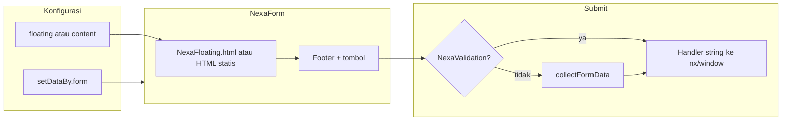

# Dokumentasi Nexa Form (NexaForm, NexaFloating, NexaValidation)

Panduan ini menjelaskan alur form di NexaJS: `**NexaForm**` sebagai orchestrator, `**NexaFloating**` untuk render field dari definisi data, dan `**NexaValidation**` untuk validasi & pengumpulan nilai sebelum callback. Referensi kode: `assets/modules/Form/NexaForm.js`, `NexaFloating.js`, `NexaValidation.js`, `NexaFormKey.js`. Objek global `**nx**` (shorthand & namespace handler) didefinisikan di `**assets/modules/Nexa.js**` — lihat §1.1.

**Alur belajar:** pahami skema field (§4) dan validasi (§5) terlebih dahulu. Untuk form **multi-langkah** (wizard), lanjut ke **[§13 Materi lanjutan — Form Wizard](#13-materi-lanjutan--form-wizard-nexawizard)** dan dokumen [`NexaWizard.md`](./NexaWizard.md).

## Daftar isi

- [1. Akses API](#1-akses-api)
  - [1.1 Global `nx` dan handler string (Nexa.js)](#11-global-nx-dan-handler-string-nexajs)
- [2. Dua cara mengisi body form](#2-dua-cara-mengisi-body-form)
  - [2.1 Statik — `content](#21-statik--content)`
  - [2.2 Deklaratif — `floating](#22-deklaratif--floating)`
  - [2.3 Contoh kode lengkap — form statis dengan `content](#23-contoh-kode-lengkap--form-statis-dengan-content)`
  - [2.4 Contoh kode lengkap — form dengan `floating](#24-contoh-kode-lengkap--form-dengan-floating)`
- [3. Konfigurasi `NexaForm(data)](#3-konfigurasi-nexaformdata)`
  - [3.1 Wajib / umum](#31-wajib--umum)
  - [3.2 Tombol & handler — `onclick](#32-tombol--handler--onclick)`
  - [3.3 Pengumpulan & validasi — `getFormBy` / `getValidationBy](#33-pengumpulan--validasi--getformby--getvalidationby)`
- [4. Skema field (`form`) untuk NexaFloating + NexaForm](#4-skema-field-form-untuk-nexafloating--nexaform)
- [5. Angka `validation` dan NexaValidation](#5-angka-validation-dan-nexavalidation)
- [6. Dua jalur saat klik "Simpan"](#6-dua-jalur-saat-klik-simpan)
- [7. `setDataBy.form` dan `storage.form](#7-setdatabyform-dan-storageform)`
- [8. Ekspor tambahan dari `NexaForm.js](#8-ekspor-tambahan-dari-nexaformjs)`
- [9. NexaFormKey — filter key form di `storage](#9-nexaformkey--filter-key-form-di-storage)`
- [10. Contoh referensi di proyek](#10-contoh-referensi-di-proyek)
- [11. Checklist troubleshooting](#11-checklist-troubleshooting)
- [12. Diagram alur (ringkas)](#12-diagram-alur-ringkas)
- [13. Materi lanjutan — Form Wizard (NexaWizard)](#13-materi-lanjutan--form-wizard-nexawizard)
  - [13.1 Kapan memakai Wizard](#131-kapan-memakai-wizard)
  - [13.2 Isi dokumen NexaWizard.md (daftar isi)](#132-isi-dokumen-nexawizardmd-daftar-isi)
  - [13.3 Akses API & contoh rute](#133-akses-api--contoh-rute)

---

## 1. Akses API

Setelah `Nexa.js` dimuat, form builder tersedia sebagai:

- `NXUI.Form(…)` — alias resmi (sama dengan `NXUI.NexaForm`)
- `import { NexaForm, collectFormData, … } from "…/Form/NexaForm.js"` — jika memanggil dari modul lain

### 1.1 Global `nx` dan handler string (Nexa.js)

Setelah `**Nexa.js**` dieksekusi, `**window.nx**` tersedia sebagai **shorthand** ke API Nexa: objek awal berisi spread `**NXUI`** plus properti internal seperti `**_global**` dan `**_ui**`, lalu dibungkus `**Proxy**` agar callback berbasis **nama string** tetap bisa dijangkau dari mana saja.

Perilaku relevan untuk `**onclick.send`** di NexaForm:

1. **Inisialisasi** — `nx` dibuat di `assets/modules/Nexa.js` (sekitar baris **1057–1065**): `window.nx = { ...window.NXUI, _global, _ui }`.
2. **Proxy** — baris **1067–1095**: saat kamu menetapkan `**nx.namaFungsi = function () { … }`**, handler `**set**` pada Proxy juga menyalin fungsi ke `**window[namaFungsi]**` (jika nilainya fungsi). Jadi pemanggilan lewat nama string bisa menemukan `window.namaFungsi` *atau* `nx.namaFungsi`.
3. **Resolusi di NexaForm** — `NexaForm.js` mencari fungsi untuk string `onclick.send` dengan urutan: `**window*`* → `**NXUI**` → `**nx**` → `**nx._global**`.

**Praktik di template route:** `nx.nexaFormDemoSubmit = async function …` di `templates/form.js` sengaja memakai `**nx`** agar konsisten dengan pola modal/route lain dan agar fungsi tetap terdaftar di namespace yang sama dengan `**NXUI**`. Alternatif setara: `**globalThis.nexaFormDemoSubmit = …**` atau `**window.nexaFormDemoSubmit = …**` (sesuai urutan resolusi di atas).

Cuplikan dari `templates/form.js` (handler yang dipanggil lewat `onclick.send: "nexaFormDemoSubmit"`):

```javascript
nx.nexaFormDemoSubmit = async function (formId, formData, setDataBy) {
  console.log("[nexaFormDemoSubmit]", { formId, formData, setDataBy });
  const out = document.getElementById("nexaFormDemoOutput");
  if (out) {
    out.textContent = JSON.stringify({ formData, setDataBy }, null, 2);
  }
};
```

---

## 2. Dua cara mengisi body form

`NexaForm` membangun struktur: header (opsional) → **body** → footer dengan tombol (jika `onclick.send` ada).

Prioritas isi **body**:


| Urutan | Properti   | Perilaku                                                                                                                                    |
| ------ | ---------- | ------------------------------------------------------------------------------------------------------------------------------------------- |
| 1      | `floating` | `new NexaFloating(data.floating, { formById, mode: "insert" })` lalu `innerHTML = template.html()` — field dari skema `form` + `variables`. |
| 2      | `content`  | String HTML statis dimasukkan ke body.                                                                                                      |


Tidak gunakan keduanya sekaligus; yang dipakai adalah `**floating` dulu**, jika tidak ada baru `**content`**.

### 2.1 Statik — `content`

Cocok untuk markup kustom cepat, potongan kecil, atau HTML yang tidak lewat generator.

- Field harus punya `**id**` / `**name**` yang konsisten dengan `getFormBy` / `getValidationBy` jika memakai validasi.
- Pastikan CSS form Nexa (mis. `form-nexa`) dimuat jika ingin tampilan seragam.

### 2.2 Deklaratif — `floating` (disarankan untuk produksi)

Cocok untuk form yang konsisten dengan kelas `**form-nexa**`, floating label, dan struktur yang dihasilkan **NexaFloating**.

Objek `floating` wajib memiliki setidaknya:

- `**form`** — objek: kunci = nama field, nilai = konfigurasi field (lihat §4).
- `**variables**` — array urutan nama field yang `condition: true` (urutan tampil).

Sering juga diset:

- `**id**` atau `**modalid**` — id elemen `<form>` dalam (dipakai opsi `formById` ke `NexaFloating`).
- `**label**` — label logika / judul form di sisi floating.
- `**settings**` — mis. `floating`, `layout`, `validation`, dll. (lihat `NexaFloating.js`).

Contoh referensi di route: `templates/form.js` (floating). Contoh **statis** dan **floating** lengkap ada di §2.3 dan §2.4 di bawah.

### 2.3 Contoh kode lengkap — form statis dengan `content`

HTML: siapkan container **sebelum** memanggil `NXUI.Form` (mis. di template route):

```html
<div id="formStatis"></div>
```

JavaScript: HTML string di `content`; field memakai `**id**` / `**name**` yang selaras dengan `getFormBy` dan `setDataBy.form`. Handler berupa **nama string** (`send`) — daftarkan fungsi di `nx` atau `window`.

```javascript
// Definisi form untuk NexaValidation (sama keys dengan field di HTML)
const formDef = {
  judul: {
    condition: true,
    name: "judul",
    id: "judul",
    validation: 2,
  },
  email: {
    condition: true,
    name: "email",
    id: "email",
    validation: 2,
  },
};

globalThis.handleFormStatis = function (formId, formData, setDataBy) {
  console.log({ formId, formData, setDataBy });
};

await NXUI.Form({
  elementById: "formStatis",
  label: "Form statis",
  content: `
    <div style="display:flex;flex-direction:column;gap:0.75rem;max-width:24rem;">
      <input type="text" id="judul" name="judul" placeholder="Judul" />
      <input type="email" id="email" name="email" placeholder="email@contoh.com" />
    </div>
  `,
  onclick: {
    title: "Simpan",
    cancel: "Batal",
    send: "handleFormStatis",
    validation: {},
  },
  setDataBy: {
    form: formDef,
    mode: "demo",
  },
  getFormBy: ["name"],
  getValidationBy: ["name"],
});
```

**Tanpa** `onclick.validation` dan `getValidationBy` yang memaksa NexaValidation, Simpan memakai `collectFormData` langsung (lihat §6). Contoh di atas memakai **NexaValidation** agar konsisten dengan form floating.

### 2.4 Contoh kode lengkap — form dengan `floating`

Satu objek `**form`** dipakai untuk `**floating.form**` dan `**setDataBy.form**` agar definisi field dan rule validasi tidak berbeda.

```javascript
const demoForm = {
  nama: {
    condition: true,
    type: "text",
    label: "Nama",
    placeholder: "Nama lengkap",
    name: "nama",
    id: "nama",
    validation: 2,
  },
  email: {
    condition: true,
    type: "email",
    label: "Email",
    placeholder: "email@contoh.com",
    name: "email",
    id: "email",
    validation: 2,
  },
  pesan: {
    condition: true,
    type: "text",
    label: "Pesan",
    placeholder: "Minimal 10 karakter",
    name: "pesan",
    id: "pesan",
    validation: 10,
  },
};

const floatingConfig = {
  id: "form_demo_nexa",
  label: "Form demo",
  variables: ["nama", "email", "pesan"],
  form: demoForm,
  settings: {
    floating: true,
    layout: "vertical",
  },
};

globalThis.handleFormFloating = function (formId, formData, setDataBy) {
  console.log({ formId, formData, setDataBy });
};

// HTML: <div id="nexaFormDemo"></div>
await NXUI.Form({
  elementById: "nexaFormDemo",
  label: "Form demo",
  floating: floatingConfig,
  onclick: {
    title: "Simpan",
    cancel: "Batal",
    send: "handleFormFloating",
    validation: {},
  },
  setDataBy: {
    form: demoForm,
    route: "/form",
  },
  getFormBy: ["name"],
  getValidationBy: ["name"],
});
```

**Catatan:** tipe `**textarea`** di NexaFloating membutuhkan `**NXUI.Editor**`; untuk pesan singkat gunakan `type: "text"` atau pastikan Editor tersedia (lihat §4).

---

## 3. Konfigurasi `NexaForm(data)`

### 3.1 Wajib / umum


| Properti      | Tipe     | Keterangan                                                                                                                        |
| ------------- | -------- | --------------------------------------------------------------------------------------------------------------------------------- |
| `elementById` | `string` | Id elemen **target** di DOM tempat form disisipkan (default `"myForm"`). Elemen ini harus sudah ada sebelum `NexaForm` dipanggil. |
| `label`       | `string` | Opsional. Judul di header `.nx-form-header`.                                                                                      |
| `floating`    | `object` | Skema NexaFloating (§2.2).                                                                                                        |
| `content`     | `string` | HTML statis jika tidak pakai `floating`.                                                                                          |
| `footer`      | `string` | HTML tambahan di sisi kiri footer (sebelum tombol).                                                                               |
| `setDataBy`   | `object` | Data bebas; ikut dikirim ke handler submit (argumen ketiga). **Harus berisi `form`** jika memakai pipeline validasi bawaan (§5).  |
| `storage`     | `object` | Alternatif sumber definisi field: `storage.form` (jika tidak memakai `setDataBy.form`).                                           |


### 3.2 Tombol & handler — `onclick`


| Properti             | Keterangan                                                                                                              |
| -------------------- | ----------------------------------------------------------------------------------------------------------------------- |
| `onclick.send`       | **String nama fungsi** (bukan referensi fungsi). Dipanggil setelah submit sukses.                                       |
| `onclick.title`      | Teks tombol utama (default `"Save"`).                                                                                   |
| `onclick.cancel`     | Teks tombol batal (default `"Cancel"`).                                                                                 |
| `onclick.validation` | Objek opsional. Jika **truthy** (termasuk `{}`), bersama `getValidationBy` dapat memaksa jalur **NexaValidation** (§6). |


**Resolusi nama handler** (urutan): `window[nama]` → `NXUI[nama]` → `nx[nama]` → `nx._global[nama]`.

Praktis: daftarkan handler di `**nx.namaHandler`** atau `**window.namaHandler**`.

**Asal `nx`:** dibuat di `**assets/modules/Nexa.js`** (lihat **§1.1** — inisialisasi ~1057–1065, Proxy ~1067–1095).

**Signature handler:**

```text
async function namaHandler(formId, formData, setDataBy) { … }
```

- `formId` — sama dengan `elementById` yang dipakai NexaForm.
- `formData` — objek key-value field (dari NexaValidation jika jalur validasi, atau dari `collectFormData` jika tanpa validasi).
- `setDataBy` — objek yang kamu pass ke `NexaForm` (termasuk metadata route, dll.).

### 3.3 Pengumpulan & validasi — `getFormBy` / `getValidationBy`

- `**getFormBy**` — default `["id"]`. Menentukan cara membaca key field saat mengumpulkan data (mis. `"id"`, `"name"`, `"data-key"`, `"data-order"`). Harus selaras dengan atribut di markup (floating menghasilkan `id` dan `name` dari nama field).
- `**getValidationBy**` — default `["name"]`. Menentukan atribut yang dipakai untuk mencocokkan **rules** di objek `validasi` NexaValidation dengan elemen input.

Jika `**onclick.validation` truthy** ATAU `**getValidationBy` diset**, NexaForm memakai `**Validation()`** (NexaValidation), bukan `collectFormData` langsung di klik Simpan.

---

## 4. Skema field (`form`) untuk NexaFloating + NexaForm

Setiap entri di `floating.form` (dan idealnya `**setDataBy.form` yang sama**) berbentuk:

```js
namaField: {
  condition: true,       // wajib true agak ikut render + ikut array validasi NexaForm
  type: "text",          // text, email, password, textarea, select, file, … (lihat NexaFloating)
  label: "Label",
  placeholder: "…",
  name: "namaField",     // disarankan sama dengan key
  id: "namaField",       // untuk matching validasi / DOM
  validation: 2,         // angka — lihat §5
  // …opsional: columnWidth, readonly, icons, limit (textarea), dll.
}
```

**Urutan tampil:** `floating.variables` menyebut nama field secara berurutan; field dengan `condition: true` yang tidak ada di `variables` bisa tetap ditampilkan setelahnya (perilaku `getOrderedFields` di NexaFloating).

**Catatan `textarea`:** di NexaFloating, tipe `**textarea`** mengikat `**NXUI.Editor**` (rich text) dan hidden textarea — untuk demo sederhana sering dipakai `**type: "text"**` atau pastikan Editor tersedia.

---

## 5. Angka `validation` dan NexaValidation

NexaForm mengubah setiap field (dari `storage.form` atau `setDataBy.form` dengan `condition: true`) menjadi entri `{ id, name, validation }`, lalu membangun objek `**validasi**` untuk `Validation()`.

Di **NexaValidation** (ringkasan perilaku untuk nilai numerik):

- `**2`** atau `**"2"**` — field **wajib diisi** (required).
- **Lebih dari `2`** — diartikan sebagai **panjang minimum** (min length), mis. `10` artinya minimal 10 karakter.
- **Array** — bisa dipakai untuk rentang `[minLength, maxLength]` (detail di implementasi NexaValidation).

Selaraskan `**getValidationBy`** dengan atribut yang ada di input (biasanya `**"name"**` atau `**"id"**`).

---

## 6. Dua jalur saat klik "Simpan"

1. **Dengan NexaValidation** — jika `data.onclick.validation` truthy **atau** `data.getValidationBy` diset: tombol submit memakai id `#submit-${formId}`, memanggil `Validation(validationConfig, callback)`, `formData = result.response`.
2. **Tanpa** — `collectFormData(formId, getFormBy)` dipanggil langsung; tidak lewat validasi NexaValidation (kecuali kamu validasi manual di handler).

---

## 7. `setDataBy.form` dan `storage.form`

NexaForm membaca:

```text
Buckets = data?.storage?.form ?? data.setDataBy.form
```

Lalu `Object.values(Buckets).filter(item => item.condition === true)` untuk membangun rules.

- **Wajib** berikan `**setDataBy.form`** atau `**storage.form**` sebagai objek (boleh kosong `{}` jika tidak ada rule, tetapi hati-hati: jika `setDataBy` tidak punya `form` dan `storage` tidak ada, kode dapat error — gunakan `{}` eksplisit).
- **Praktik terbaik:** satu objek `**form`** dipakai bersama untuk `**floating.form**` dan `**setDataBy.form**` agar definisi field dan validasi tidak divergen.

---

## 8. Ekspor tambahan dari `NexaForm.js`


| Ekspor                                    | Fungsi                                                                                                                          |
| ----------------------------------------- | ------------------------------------------------------------------------------------------------------------------------------- |
| `collectFormData(containerId, getFormBy)` | Mengumpulkan data dari elemen di dalam `#containerId` (input, textarea, pola radio/checkbox khusus, file → binary array, dll.). |
| `setupColorSync(containerId)`             | Sinkron input `type="color"` dengan input teks ber-id `…Value`.                                                                 |
| `fileToBinaryArray`                       | Helper konversi `File` ke array byte.                                                                                           |


---

## 9. NexaFormKey — filter key form di `storage`

`NXUI.NexaFormKey` (lihat `NexaFormKey.js`) memfilter objek `storage.form`:

- `NexaFormKey.include(storage, ['key1', 'key2'])` — hanya key yang disebutkan.
- `NexaFormKey.exclude(storage, ['key1'])` — kecualikan key.

Berguna saat satu definisi form besar dipakai berulang dengan subset field.

---

## 10. Contoh referensi di proyek

- Route `**/form**`: `templates/form.js` — **NexaFloating** + `**setDataBy.form`** + **NexaValidation** + handler `**nx.nexaFormDemoSubmit`**.
- Route `**/wizard**`: `templates/wizard.js` — **NexaWizard** (`NXUI.FormWizard`) — form bertahap; bisa inline atau dibuka lewat **modal** (`NXUI.Modal` + opsi `wizard:`). Detail: [§13](#13-materi-lanjutan--form-wizard-nexawizard) dan [`NexaWizard.md`](./NexaWizard.md).
- Modal dengan `floating`: `templates/modal.js` (NexaFloating di body modal). Modal dengan `wizard`: pola sama, ganti `floating` → `wizard` (lihat `NexaModalHtml.js`).

---

## 11. Checklist troubleshooting

- Handler submit adalah **string nama**; fungsi harus ada di `window` / `NXUI` / `nx`.
- `**setDataBy.form`** selaras dengan field yang di-render (`floating` atau `content`).
- `**getFormBy` / `getValidationBy**` cocok dengan atribut di DOM (`id` vs `name`).
- Path modul & MIME: import harus mengembalikan JavaScript, bukan HTML (404 / SPA fallback).
- `**textarea**` di NexaFloating membutuhkan `**NXUI.Editor**`; pertimbangkan `type: "text"` untuk form sederhana.

---

## 12. Diagram alur (ringkas)



---

## 13. Materi lanjutan — Form Wizard (NexaWizard)

Setelah memahami **NexaFloating** dan skema `form` di atas, Anda bisa memecah satu form panjang menjadi **beberapa langkah** dengan **`NexaWizard`** (alias global **`NXUI.FormWizard`**). Skema field **sama** dengan NexaFloating; yang ditambahkan adalah **`settings.wizard`** (pembagian langkah, judul langkah, label tombol).

### 13.1 Kapan memakai Wizard

| Situasi | Saran |
| --- | --- |
| Banyak field sekaligus membingungkan pengguna | Pakai wizard: `fieldsPerStep` atau `steps` eksplisit. |
| Alur sama seperti form satu halaman, hanya ingin progres visual | Wizard + indikator langkah (`form-nexa-wizard-progress`). |
| Perlu submit di modal multi-langkah | `NXUI.Modal({ wizard: { … } })` — footer Simpan bawaan modal **tidak** dipakai; submit lewat tombol **Kirim** di dalam form wizard. |

### 13.2 Isi dokumen NexaWizard.md (daftar isi)

Dokumentasi lengkap ada di **[`docs/NexaWizard.md`](./NexaWizard.md)**. Ringkasan isinya:

| Bagian di `NexaWizard.md` | Topik |
| --- | --- |
| §1–2 | Ringkasan fitur, akses API (`FormWizard` / `NexaWizard`) |
| §3–5 | Skema `formData`, `settings.wizard`, opsi konstruktor |
| §6–7 | Validasi per langkah, Enter, `nexaFormSubmit`, `onSubmit`, `send` |
| §8 | `html()`, `render()`, `bindToDom()` |
| §9 | Wizard di **modal** (`NexaModalHtml` + `bindToDom`) |
| §10–11 | CSS (`form.css`, `button.css`), contoh kode |
| §12 | Troubleshooting singkat |

### 13.3 Akses API & contoh rute

```javascript
// Setelah Nexa.js dimuat
const w = new NXUI.FormWizard(schema, { mode: "insert", footer: true });
w.render(mount); // atau innerHTML + bindToDom untuk alur string HTML
```

- **Rute demo:** `App.js` memuat route `wizard` → `templates/wizard.js` (mode **content** vs **modal** lewat konstanta `WIZARD_UI`).
- **Modal:** `nx.openWizardModalDemo('wizard1')` di `templates/wizard.js` memanggil `NXUI.Modal` dengan **`wizard:`** (bukan `floating:`).

---

Dokumen ini diselaraskan dengan perilaku kode di `assets/modules/Form/` pada proyek ini; jika perilaku internal berubah, sesuaikan §5 dan §6 dengan `NexaValidation.js` / `NexaForm.js` terbaru. Untuk perilaku **wizard** spesifik, utamakan [`NexaWizard.md`](./NexaWizard.md) dan `NexaWizard.js`.